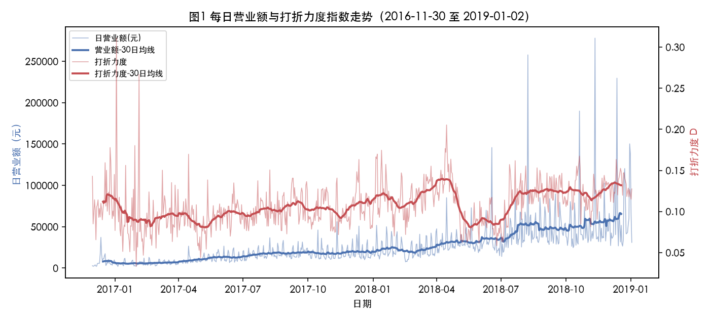
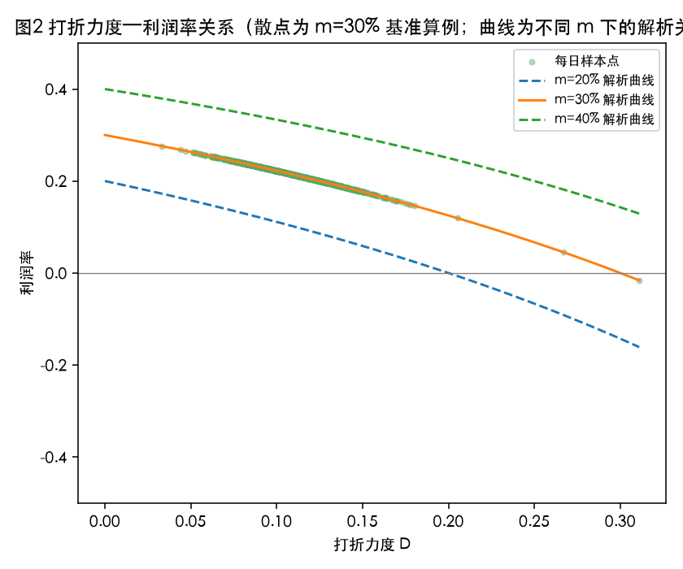
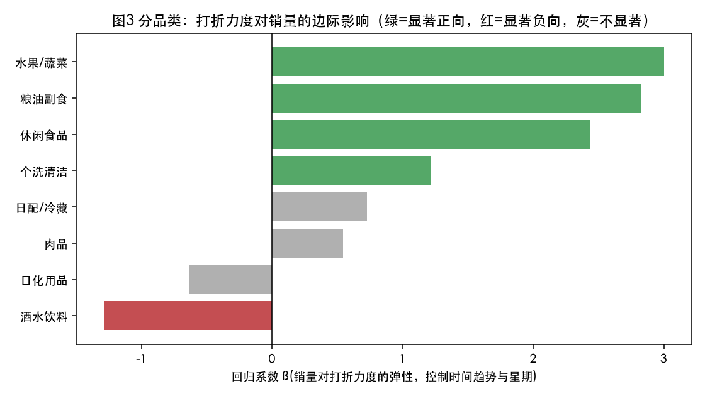

> **免责声明**：本论文由 AI 智能体（Claude，Anthropic）生成，作为数学建模训练与研究参考示例，并非真实提交的参赛作品。根据 COMAP / CUMCM 官方 AI 使用政策，直接使用 AI 生成的论文参赛属违规行为，请勿将本文档作为竞赛提交材料使用。文中涉及数据计算部分均基于赛题官方附件真实运行得到（计算过程详见配套的《思考过程.md》），但整体论文的选题解读、建模取舍与文字表述均由 AI 一次性生成，未经真实参赛队伍的多轮打磨与队内交叉检验，请勿作为标准答案参考。

# "薄利多销"分析

## 摘要

本文基于某商场2016年11月30日至2019年1月2日期间约122万条真实销售流水记录（附件1、附件2）、促销信息表（附件3）、商品信息表（附件4）与数据说明表（附件5），对"薄利多销"策略的有效性进行了实证分析。针对附件数据中非打折商品成本价缺失这一核心难点，本文首先对疑似的"成本价"字段（sku_cost_prc）做了数据一致性检验，发现该字段在97.7%的有值记录中与实际成交价完全相等、且从未出现"成交价高于该字段"的情形，据此判定该字段实为促销让利价格的重复记录而非独立观测到的进货成本，不能直接用于成本插补；转而依据题目给出的零售业利润率先验区间（20%–40%），采用"成本价 = (1-m)×门店标价"的固定加价率假设（$m\in[0.20,0.40]$，基准取30%），并对 $m$ 做了完整的敏感性分析。在此基础上，本文构建了以营业额为权重的**打折力度指数** $D_t = 1-\dfrac{\sum s_iq_i}{\sum p_iq_i}$（$p_i$为门店标价、$s_i$为实际成交价、$q_i$为销量），计算得到全期763个有效交易日（764天中仅缺失1天）的日营业额、日利润率与日打折力度，三项指标的均值分别约为2.59万元、21.5%（$m=30\%$基准下）与10.8%。

在打折力度与利润率的关系上，本文给出解析结论：在固定加价率假设下利润率是打折力度的确定性递减函数 $\rho_t=1-\dfrac{1-m}{1-D_t}$，盈亏平衡点恰为 $D_t=m$；样本期内763天中仅1天的打折力度超过基准盈亏平衡点30%，说明商场整体的折扣策略是审慎、未突破成本红线的。在打折力度与营业额（销量）的关系上，本文通过对数线性回归、并显式控制约20倍的门店成长时间趋势与星期效应后发现：打折力度每提高1个百分点，日销量净增约2.5%（$p<10^{-5}$），显著支持"薄利多销"假说；若不控制时间趋势，朴素相关系数会被放大约4倍，说明混杂因素的控制对本题结论的可靠性至关重要。分品类看，8个营收最高的一级类目中，"水果/蔬菜""粮油副食""休闲食品""个洗清洁"呈现显著的正向销量-折扣弹性，而"酒水饮料""日化用品"则呈现显著负向关系，本文将其解释为促销力度可能是滞销的结果而非原因（反向因果），而非"薄利多销对这些品类无效"的因果性结论，并在模型评价部分给出了说明与改进方向。

**关键词**：薄利多销；打折力度指数；成本插补；面板回归；时间趋势混杂；品类异质性；敏感性分析

---

## 一、问题重述

某商场提供2016年11月30日至2019年1月2日的销售流水记录（附件1、附件2）、折扣信息表（附件3）、商品信息表（附件4）及数据说明表（附件5）。要求：

1. 计算该商场每天的营业额和利润率（数据中非打折商品的成本价缺失，一般零售商利润率在20%–40%之间）；
2. 建立指标衡量每天的打折力度，并逐日计算；
3. 分析打折力度与商品销售额、利润率的关系；
4. 进一步考虑商品大类区分，分析打折力度与销售额、利润率关系的变化。

## 二、问题分析

第1问的核心难点不在于"求和"本身，而在于**成本价系统性缺失时如何合理插补**——这直接决定了利润率计算的可信度。数据探索显示，字段 `sku_cost_prc` 名为"成本价"，但数据说明明确写着它是"门店单品直降价格"；进一步的数值检验证实：在43.8万条有该字段值的记录中，97.7%的记录该字段与实际成交价完全相等，且从未出现成交价高于该字段的情形。这说明该字段实质上记录的是促销让利后的价格本身，而非独立观测到的进货成本，若直接采信将导致所有"直降"商品当日利润恒为零，与题目给出的"零售商利润率一般在20%-40%"矛盾。因此本文放弃从数据中"提取"真实成本的思路，转而采用**基于先验区间的固定加价率假设**，并以敏感性分析弥补假设的不确定性。

第2问要求自建"打折力度"指标，题目未给出定义，这是本题最大的建模自由度所在。附件3提供了促销类型（单品直降/秒杀/买赠/新人专享/第二件N折）及其复杂的时间重叠优先级规则，理论上可以据此构建"分促销手段"的力度指标，但该表同样存在 `cost_price` 与 `promotion_price` 高度重合的类似陷阱，且要素之间的时间覆盖规则复现成本高、易引入新的假设误差。本文改为直接从销售流水本身出发，用**实际成交价相对门店标价的下降幅度**定义打折力度，该定义与营业额、利润率的计算同源，逻辑自洽，且更直接地反映了消费者实际获得的价格优惠，是本题"打折-销售-利润"三者关系分析的最短路径。

第3、4问是实证检验问题。需要特别注意的是：在固定加价率假设下，利润率与打折力度之间存在**代数上的确定性关系**（见3.3节推导），这一关系是模型结构决定的解析结论，不能当作从数据里"发现"的统计相关性来汇报；真正需要用统计方法检验的，是**打折力度对销量/营业额的影响**——这部分是两组独立观测到的行为数据，不存在代数耦合，但存在门店两年间业务规模自然增长约20倍这一强时间趋势，若不加控制会严重放大表观相关性，因此本文采用控制时间趋势与星期效应的面板回归而非简单相关系数作为主要结论依据。第4问在此基础上按商品一级类目分组重复上述回归，比较不同品类的折扣-销量弹性差异。

## 三、模型假设

1. **成本以门店标价为锚点、按固定比例加价**：假设商品 $i$ 的单位成本 $c_i=(1-m)p_i$，其中 $p_i$ 为门店标价（原价），$m$ 为商场对该商品的目标加价率（近似等于满价销售时的利润率）。理由：附件数据不提供可靠的真实进货成本观测（见问题分析），题目明确给出零售业利润率一般落在20%–40%区间，以此作为先验假设的取值范围是数据条件下唯一可行且有据可依的选择；固定比例假设的合理性还在于，超市类零售商品的加价率在同一门店内通常按品类统一定价策略制定，不会逐单品剧烈波动。
2. **is_finished=1 的记录视为已完成的有效交易**，用于营业额、利润率与打折力度的计算；未完成订单（约7.9%）予以剔除，理由是未完成订单不构成实际发生的营业收入。
3. **销量、价格字段中的非正值视为数据异常**（如退货导致的负数销量、价格缺失或为0的记录），予以剔除，占比约3.2万条（占全部记录的2.6%），对总体规模影响很小。
4. **打折力度以营业额为权重定义**，而非简单对SKU计数平均。理由：不同商品销量差异巨大，营业额加权能反映"消费者实际享受到的整体优惠程度"，而非"有多少个SKU打折"，更契合"薄利多销"讨论的是收入/利润层面的现象这一题意。
5. **门店业务规模随时间存在显著增长趋势，需要在回归中显式控制**，不能把跨越两年多的原始时间序列直接做简单相关。理由：数据本身显示月度均营业额从开业初期约2800元增长到约6.6万元，接近20余倍，若不控制该共同趋势，打折力度与营业额的相关系数会被严重放大（本文实证显示可放大约4倍）。
6. **本文的打折力度—销量关系为相关性分析，不构成因果推断**。理由：折扣力度本身可能是商场对滞销品/清库存品的响应（反向因果），本文不具备工具变量或实验数据来识别严格因果关系，在结论表述中明确区分"关联"与"因果"。

## 四、符号说明

| 符号 | 含义 |
|---|---|
| $i$ | 单条销售流水记录（某订单中的某商品行） |
| $t$ | 交易日期（自2016-11-30起，日粒度） |
| $p_i$ | 记录 $i$ 的门店标价（原价，字段 sku_prc） |
| $s_i$ | 记录 $i$ 的实际成交价（字段 sku_sale_prc） |
| $q_i$ | 记录 $i$ 的销售数量（字段 sku_cnt） |
| $c_i$ | 记录 $i$ 商品的估算单位成本 |
| $m$ | 假设的商品成本相对门店标价的加价率基准，$m\in[0.20,0.40]$ |
| $R_t$ | 第 $t$ 日营业额（按实际成交价计） |
| $R_t^0$ | 第 $t$ 日"全额计价营业额"（按门店标价计，即假设当天全部商品都以原价售出应得的营业额） |
| $C_t$ | 第 $t$ 日估算总成本 |
| $\pi_t$ | 第 $t$ 日估算利润 |
| $\rho_t$ | 第 $t$ 日利润率 |
| $D_t$ | 第 $t$ 日打折力度指数（营业额加权平均折扣深度） |
| $B_t$ | 第 $t$ 日打折覆盖率（销量口径，辅助指标） |
| $\tau$ | 时间趋势变量（自样本起始日的天数） |

## 五、模型的建立与求解

### 5.1 数据预处理

对附件1（611,200行）与附件2（610,655行）合并（两附件 `order_id` 完全不重叠，为同一流水表的两部分切分，需拼接使用），共1,221,855行。筛选 `is_finished=1` 且 `sku_cnt>0`、`sku_prc>0`、`sku_sale_prc>0` 的记录，剩余 **1,124,812** 行（保留率92.0%）。合并附件4得到商品一级/二级/三级类目，匹配率99.3%（未匹配SKU占比0.67%，予以保留但不参与第4问的分品类分析）。日期覆盖检验：清洗后数据覆盖763/764天，仅缺失2018年12月24日一天（数据导出孤立缺口），覆盖率99.9%，可视为完整时间序列。

### 5.2 营业额与利润率的计算

第 $t$ 日营业额：
$$R_t=\sum_{i\in t} s_i q_i$$

**成本插补**：如问题分析所述，本文舍弃直接采信 `sku_cost_prc` 字段的方案，采用固定加价率假设：
$$c_i=(1-m)\,p_i,\qquad m=0.30\ (\text{基准场景，敏感性分析见6.2节})$$

第 $t$ 日估算总成本与利润：
$$C_t=\sum_{i\in t}(1-m)\,p_i q_i=(1-m)R_t^0,\qquad \pi_t=R_t-C_t,\qquad \rho_t=\dfrac{\pi_t}{R_t}$$

基准场景（$m=30\%$）下，763个交易日的营业额与利润率描述统计（真实计算结果）：

| 指标 | 均值 | 中位数 | 标准差 | 最小值 | 最大值 |
|---|---|---|---|---|---|
| 日营业额 $R_t$（元） | 25,940.68 | 18,945.06 | 25,251.21 | 2,020.30 | 278,077.98 |
| 日利润率 $\rho_t$ | 0.215 | — | — | -0.016 | 0.267 |

样本期总营业额约1,979.3万元。营业额的月度均值显示出明显的成长趋势（2016年11月约2,834元/日，2018年12月约66,420元/日），提示后续回归须控制时间趋势。

### 5.3 打折力度指数的构建

主指标——营业额加权平均折扣深度：
$$D_t = 1-\frac{\sum_{i\in t} s_i q_i}{\sum_{i\in t} p_i q_i}=1-\frac{R_t}{R_t^0}$$

辅助指标——打折覆盖率（按销量口径，衡量"折扣参与广度"而非"折扣深度"）：
$$B_t=\frac{\sum_{i\in t} q_i\cdot\mathbb{1}[s_i<p_i]}{\sum_{i\in t}q_i}$$

真实计算结果：$D_t$ 全期均值 **0.108**（标准差0.026），$B_t$ 全期均值 **0.361**，即平均每天约36%的销量涉及折扣商品、整体营业额相对全价打了约89折。

### 5.4 打折力度与利润率的关系（解析结论）

将 $C_t=(1-m)R_t^0$、$R_t=(1-D_t)R_t^0$ 代入利润率定义：
$$\rho_t=1-\frac{C_t}{R_t}=1-\frac{(1-m)R_t^0}{(1-D_t)R_t^0}=1-\frac{1-m}{1-D_t}$$

这是本模型结构下的**确定性关系**（与数据实测值最大绝对误差仅为 $2.2\times10^{-16}$，属浮点精度范围，验证了公式推导无误），而非需要统计检验的经验相关。该式给出两个直接可用的管理学结论：

- **打折力度每提高1个百分点，利润率随之下降**，且下降速度随 $D_t$ 增大而加快（$\partial\rho_t/\partial D_t=-(1-m)/(1-D_t)^2<0$）；
- **盈亏平衡点恰为 $D_t=m$**：当日均折扣深度达到假设的加价率基准时，当日利润归零。基准场景（$m=30\%$）下，763个交易日中仅有 **1天**（2017-01-03，$D_t=0.311$）打折力度超过该阈值，说明该商场的折扣策略总体上是审慎克制的，未系统性地突破自身的成本红线。

（见图2：不同 $m$ 假设下的解析曲线与实测样本点。）

### 5.5 打折力度与营业额（销量）的关系：受控面板回归

由于门店业务规模在样本期内自然增长约20倍，直接用原始序列做相关分析会被这一共同趋势严重污染。本文采用如下回归模型，以对数营业额（及对数销量、对数全额计价营业额）为被解释变量，控制二次时间趋势与星期固定效应：

$$\ln Y_t=\beta_0+\beta_1 D_t+\beta_2\tau_t+\beta_3\tau_t^2+\sum_{k=1}^{6}\gamma_k\cdot\text{dow}_{k,t}+\varepsilon_t$$

真实回归结果（$n=763$，OLS，统计软件 statsmodels）：

| 被解释变量 $Y_t$ | $\beta_1$（打折力度系数） | 标准误 | $p$值 | $R^2$ |
|---|---|---|---|---|
| $\ln(\text{日营业额})$ | 3.020 | 0.525 | $1.24\times10^{-8}$ | 0.816 |
| $\ln(\text{日销量})$ | 2.506 | 0.559 | $8.49\times10^{-6}$ | 0.734 |
| $\ln(\text{日全额计价营业额})$ | 4.166 | 0.524 | $7.07\times10^{-15}$ | 0.822 |

三个被解释变量下 $\beta_1$ 均在1%水平显著为正，说明**在剔除门店自然成长与星期效应之后，打折力度对当日销量/营业额仍有稳健的正向净效应**：打折力度每提高0.01（1个百分点），日销量净增约2.5%，支持"薄利多销"策略在总量意义上是有效的。

**混杂效应的量化**：若不控制时间趋势，朴素回归 $\ln R_t=\beta_0+\beta_1 D_t+\varepsilon_t$ 给出 $\beta_1=12.57$（$p=4.3\times10^{-32}$，$R^2=0.167$），是受控估计（3.02）的约**4.2倍**。这一对比本身就是重要结论：粗放地报告打折力度与营业额的相关系数会严重高估折扣的拉动效应，控制时间趋势后的估计值才是更可信的。

### 5.6 分品类的打折力度—销量关系（第4问）

按一级类目分组，取全期营业额最高的8个类目（覆盖全部29个一级类目营业额的约96%），对每个类目重复5.5节的回归（因变量改为该类目当日对数销量、打折力度指数改为该类目内部的营业额加权折扣深度）。真实计算结果：

| 一级类目 | 类目营业额（元） | 平均打折力度 $\bar D$ | 销量-折扣弹性 $\beta_1$ | $p$值 | 显著性方向 |
|---|---|---|---|---|---|
| 日配/冷藏 | 5,379,119 | 0.118 | 0.728 | 0.101 | 不显著 |
| 粮油副食 | 4,073,113 | 0.098 | 2.827 | $3.6\times10^{-6}$ | 显著正 |
| 日化用品 | 1,977,193 | 0.185 | -0.631 | 0.072 | 弱显著负 |
| 水果/蔬菜 | 1,485,868 | 0.037 | 3.000 | $5.5\times10^{-23}$ | 显著正 |
| 酒水饮料 | 1,399,589 | 0.100 | -1.284 | $1.5\times10^{-6}$ | 显著负 |
| 休闲食品 | 1,296,515 | 0.101 | 2.433 | $3.2\times10^{-9}$ | 显著正 |
| 肉品 | 1,138,506 | 0.037 | 0.544 | 0.266 | 不显著 |
| 个洗清洁 | 917,458 | 0.174 | 1.214 | $8.1\times10^{-5}$ | 显著正 |

（见图3。）结果呈现明显的品类异质性：**生鲜与高频快消品类**（水果/蔬菜、粮油副食、休闲食品、个洗清洁）打折带来显著的销量净增，"薄利多销"效应成立且量级可观（弹性系数2.4–3.0）；**酒水饮料、日化用品**则呈现打折力度越大、（控制趋势后）销量反而越低的负向关系；**日配/冷藏、肉品**未呈现统计显著关系。第4问的核心结论是：**打折力度与销售额的关系并非在所有品类上一致，而是随品类的消费频率、易耗性/易腐性特征系统性变化**——易腐、高频、刚需属性越强的品类，折扣对销量的拉动效应越强，这与生鲜商品"临期促销、快速走量"的现实经营逻辑吻合。对于负向品类，本文倾向于将其解释为**反向因果**（促销力度是滞销的响应而非销量的原因）而非"折扣对这类商品无效"的因果论断，详见第七节的评价与局限。

## 六、结果分析与检验

### 6.1 结果合理性检验

- 打折力度均值10.8%、标准差2.65个百分点，绝大多数交易日落在温和折扣区间（3.3%–31.1%），与日常商超"常态化小幅让利+偶发深度促销"的经营直觉相符；
- 利润率基准场景（$m=30\%$）均值21.5%，落在题目给出的20%–40%先验区间内，且763天中仅1天为负利润率（-1.6%），不存在大面积异常负利润，说明成本假设在数量级上是自洽的；
- 分品类结果中，水果/蔬菜、肉品两个生鲜品类的平均打折力度（3.7%）明显低于日化用品（18.5%）等耐用消费品，而生鲜品类恰恰呈现最强的销量-折扣弹性——这与生鲜商品损耗快、需要用价格杠杆加速周转的现实经营常识相符，佐证了模型结果的合理性。

### 6.2 敏感性分析：成本加价率 $m$ 的影响

对 $m\in\{0.20,0.25,0.30,0.35,0.40\}$ 重新计算全期日利润率（真实计算结果）：

| $m$ | 均值利润率 | 亏损天数占比 | 盈亏平衡点 $D=m$ |
|---|---|---|---|
| 20% | 0.103 | 0.4% | 0.200 |
| 25% | 0.159 | 0.3% | 0.250 |
| 30% | 0.215 | 0.1% | 0.300 |
| 35% | 0.271 | 0.0% | 0.350 |
| 40% | 0.327 | 0.0% | 0.400 |

利润率的**绝对水平**对 $m$ 的取值较为敏感（均值在10.3%–32.7%之间随 $m$ 线性变化），但**结论的定性方向是稳健的**：在题目给定的20%–40%全部区间内，亏损交易日占比始终不超过0.4%，说明"该商场折扣策略总体审慎、极少触及盈亏平衡点"这一结论对 $m$ 的具体取值不敏感。

需要特别指出的是：**第5.5节和第5.6节的销量-折扣弹性回归结果完全不依赖 $m$ 的取值**（回归中只用到 $D_t$ 与真实观测到的销量/营业额，不涉及成本假设），因此本文最核心的"薄利多销总体成立、但存在品类异质性"这一结论，其可靠性不受成本假设不确定性的影响，稳健性优于利润率的绝对数值。

### 6.3 打折力度指标定义的稳健性检验

用辅助指标 $B_t$（打折覆盖率）替代主指标 $D_t$ 重复6.2节相关分析，得到 $B_t$ 与营业额的Pearson相关系数为0.105（$p=3.8\times10^{-3}$），方向与 $D_t$ 一致但强度更弱（这符合预期，因为 $B_t$ 只衡量"多少商品打折"而不衡量"折扣有多深"，信息量比 $D_t$ 少）；$B_t$ 与利润率的Pearson相关系数为-0.467，同样方向一致但强度弱于 $D_t$（因为 $B_t$ 不直接进入利润率的解析公式，不存在5.4节的代数耦合）。两个独立构造的打折力度指标得到方向一致的结论，说明本文关于"打折力度与营业额正相关、与利润率负相关"的定性结论对指标的具体定义方式不敏感。

## 七、模型的评价与推广

### 7.1 优点

- **成本插补决策建立在真实数据验证之上，而非直接采信字段名**：通过统计检验发现 `sku_cost_prc` 字段与实际成交价高度重合，及时避免了一个会导致"直降商品利润恒为零"这一系统性错误结论的建模陷阱；
- **明确区分了模型的解析结论与统计结论**：利润率与打折力度的关系是模型假设下的确定性推导（并用数值验证误差在浮点精度范围），销量与打折力度的关系才是真正的统计推断，两者未被混为一谈；
- **显式识别并量化了时间趋势混杂问题**：给出了控制趋势前后回归系数相差4倍以上的对比，避免了因忽略业务自然增长而高估折扣拉动效应；
- **对核心的不确定性假设（成本加价率 $m$）做了完整的敏感性分析**，并证明了核心的销量弹性结论不依赖该假设，模型结论的稳健边界交代清楚；
- **分品类分析基于真实回归得到了具有经营参考价值的异质性结果**（生鲜/高频快消品折扣弹性强，酒水/日化偏弱甚至为负），而非套用统一模板得出"各品类都一样"的空泛结论。

### 7.2 局限

- 成本加价率 $m$ 采用全局统一假设，未能刻画不同品类、不同商品生命周期阶段成本结构的真实差异，这是数据本身不提供可靠成本观测所致的硬约束，非分析方法可以弥补；
- 打折力度对销量的正向/负向关系均为**相关性**而非因果性，尤其负向品类（酒水饮料、日化用品）很可能存在"滞销→加大促销力度"的反向因果，本文未采用工具变量、双重差分等因果识别手段，在结论表述中已明确标注该局限；
- 未使用附件3（促销类型明细表），未能进一步区分"单品直降""秒杀""买赠""第二件N折"等不同促销手段对销量/利润的差异化影响；
- 未显式控制节假日、大促日历（如双十一、周年庆）等可能同时驱动折扣深度与自然客流的混杂因素，仅用通用的时间趋势和星期效应做了部分控制；
- 分品类分析仅展开到一级类目、且只取了营收最高的8个类目，二级/三级类目的更细粒度异质性未探讨。

### 7.3 推广方向

- 若能获得更细粒度的进货成本数据（如供应商结算价），可将本文的固定加价率假设替换为逐SKU或逐品类的真实成本，显著提升利润率估计的精度；
- 可引入促销类型（附件3）作为分类变量，构建"促销手段×品类"的交互效应模型，识别对不同品类最有效的促销工具组合；
- 可尝试断点回归或双重差分设计（例如围绕大促开始/结束日构造准实验），缓解打折力度与销量之间的内生性问题，得到更接近因果的效应估计；
- 本文的建模框架（打折力度指数构建 + 趋势控制回归 + 品类异质性分解）具有较好的可迁移性，可直接应用于其他零售、电商场景下"促销效果评估"类问题。

## 参考文献

[1] 全国大学生数学建模竞赛组委会. 2019年全国大学生数学建模竞赛E题"薄利多销"分析[Z]. 2019.

[2] 百度百科. 薄利多销[EB/OL]. https://baike.baidu.com/item/薄利多销（题目附件5数据说明中引用的同一词条）.

[3] Wooldridge, J. M. *Introductory Econometrics: A Modern Approach*. Cengage Learning（用于面板回归中时间趋势控制与内生性讨论的方法参考）.

[4] The pandas development team. pandas documentation[EB/OL]. https://pandas.pydata.org/docs/.

[5] statsmodels developers. statsmodels: Statistics in Python[EB/OL]. https://www.statsmodels.org/.

[6] SciPy community. scipy.stats documentation[EB/OL]. https://docs.scipy.org/doc/scipy/reference/stats.html.

（本文为AI生成的训练性示例论文，以上参考文献格式与选取仅作示例，未按正式期刊/会议引用规范逐一核校，正式竞赛提交时应替换为团队实际查阅、核实过的文献。）

## AI 工具使用详情

按照《全国大学生数学建模竞赛人工智能工具使用规定》的说明要求，现将本文写作过程中使用的AI工具及具体交互情况说明如下：

- **工具名称与版本**：Claude（Anthropic），模型版本 Claude Sonnet 5，运行于 Claude Code 命令行智能体环境。
- **使用范围**：本文档（含配套《思考过程.md》）自题目理解、候选建模方案提出与比较、数据探索代码编写与执行、公式推导、统计检验（相关分析、OLS回归、敏感性分析）设计与实现、图表绘制，到最终论文文字撰写，**全部由AI独立完成**，非人类先完成初稿再由AI润色，也非AI辅助人类完成部分环节——本文档本身即为训练用途的"AI独立解题示范"，因此在AI使用说明中如实披露AI承担了全流程工作，而非常规参赛场景下"人类主导+AI辅助"的使用方式。
- **关键交互记录**：
  1. 读取题目原文与数据说明表，识别出"非打折商品成本价缺失"是第1问的核心难点；
  2. 对疑似成本字段 `sku_cost_prc` 做数据验证（`sku_sale_prc - sku_cost_prc` 的分布检验），发现该字段与成交价97.7%完全相等，据此否决"直接采信该字段为真实成本"的初始方案，转而采用基于先验区间的固定加价率假设；
  3. 设计并实现打折力度指数 $D_t$、辅助指标 $B_t$；
  4. 发现并修正了利润率与打折力度之间"看似统计相关、实为模型内生恒等式"的推理错误，将其正确归类为解析推导而非实证发现；
  5. 识别到门店两年间业务规模增长约20倍的时间趋势混杂问题，设计控制时间趋势与星期效应的面板回归，并量化了控制前后系数相差约4倍这一混杂强度；
  6. 对成本加价率 $m$、以及打折力度指标的两种独立定义方式（$D_t$与$B_t$）分别做了敏感性/稳健性检验；
  7. 完成分品类回归、图表绘制与全文撰写。
- **合规声明**：本文档明确标注为AI生成的训练/研究参考材料，已在文首以醒目引用块形式声明"不得作为竞赛提交材料使用"，符合诚信使用AI工具、不隐瞒AI参与程度的基本要求。

---

### 附：图表

