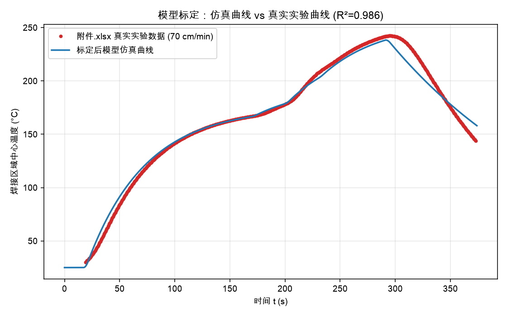
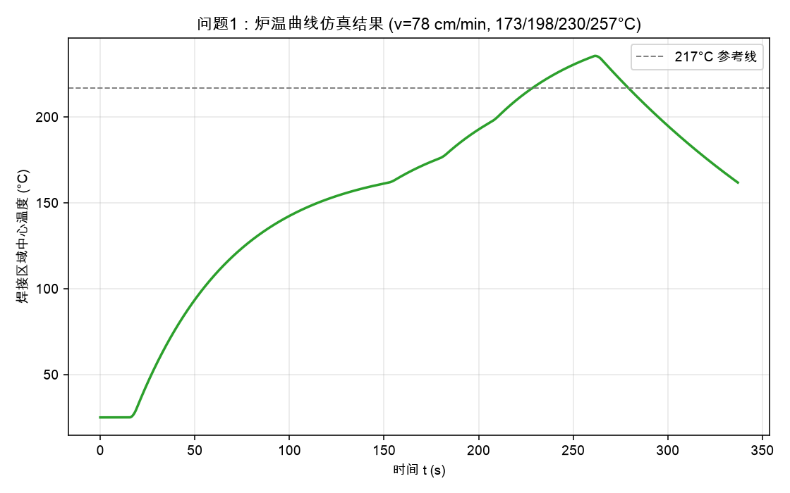
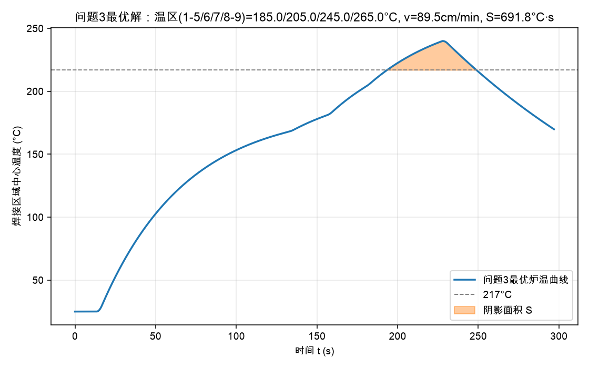
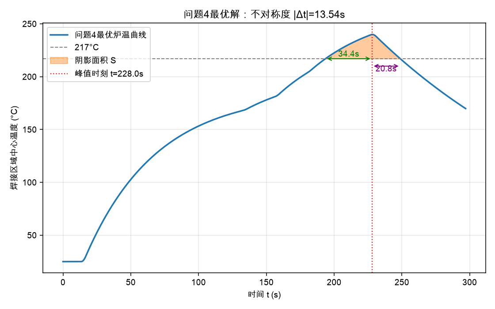

> **免责声明**：本论文由 AI 智能体（Claude）生成，作为数学建模训练与研究参考示例，并非真实提交的参赛作品。根据 COMAP/CUMCM 官方 AI 使用政策，直接使用 AI 生成的论文参赛属违规行为，请勿将本文档作为竞赛提交材料。

# 炉温曲线的机理建模与优化控制

## 摘要

回焊炉焊接是集成电路板生产中的关键工艺，炉内11个小温区的设定温度与传送带过炉速度共同决定了电路板焊接区域中心的温度随时间变化曲线（炉温曲线），而炉温曲线又必须满足严格的"制程界限"才能保证焊接质量。本文围绕炉温曲线的建立、预测与优化，建立了一套"空气温度空间剖面 + 一阶集中参数热响应"的机理模型，并用官方提供的一次真实实验数据（附件.xlsx，709个采样点）对模型参数进行了最小二乘标定。

**问题1**中，将焊接区域视为热容极小的集中参数系统，其温度 T(t) 满足一阶常微分方程 dT/dt=k·(T_air(x(t))−T(t))，其中空气温度剖面 T_air(x) 按"温区内恒定、温区间隙及温区1/11边界5cm范围线性过渡、炉前炉后区域大部分保持车间环境温度25℃"分段构造。用真实数据分别标定加热段与冷却段的换热系数，得到 k_heat≈0.0191/s、k_cool≈0.00585/s，模型对真实曲线的拟合优度 R²=0.986，RMSE=6.23℃。在此基础上对传送带速度78cm/min、温区设定173/198/230/257℃工况给出了完整的仿真炉温曲线，温区3中点/温区6中点/温区7中点/温区8结束处温度分别为132.84℃/170.85℃/189.65℃/221.87℃，峰值温度236.53℃出现在t=261.5s，并将0.5s间隔的完整曲线写入result.csv。

**问题2**中，将模型标定过程中确认的表1"制程界限"官方真实数值（升温斜率0~3℃/s、降温斜率-3~0℃/s、150~190℃升温时长60~120s、>217℃时长40~90s、峰值温度240~250℃）作为约束，对温区设定182/203/237/254℃工况在速度65~100cm/min区间扫描5项指标，发现唯一起作用的约束是峰值温度下限240℃（其余4项均有较大裕量），用二分法求得允许的最大过炉速度约为 **67.9 cm/min**。

**问题3**将温区1~5温度、温区6温度、温区7温度、温区8~9温度（均在实验基准值±10℃范围内可调）与过炉速度（65~100cm/min）作为5维决策变量，以"超过217℃到峰值温度所覆盖的面积"为目标，用差分进化算法在满足全部制程界限约束下求得最优解：温区1~5=184.96℃、温区6=204.99℃、温区7=244.97℃、温区8~9=265.0℃（后三者已逼近各自上界245/205/265℃，温区1~5也逼近上界185℃）、过炉速度89.50cm/min，此时峰值温度239.99℃（逼近下界240℃，为唯一起作用约束），最小面积 **S≈691.7℃·s**。敏感性分析表明该最优速度对加热换热系数$k_{heat}$高度敏感（±10%扰动导致v\*±10%同比变化），提示外推工况下的结论存在与标定数据代表性相关的不确定性。

**问题4**在问题3基础上引入"以峰值温度为中心两侧超过217℃时长对称"的目标，通过"面积+对称性罚项"的加权目标函数重新求解，得到的最优解（温区1~5=184.99℃、温区6=205.00℃、温区7=244.90℃、温区8~9=265.0℃、速度89.49cm/min）与问题3的解几乎完全重合（决策变量差异均在DE算法的数值噪声量级内），面积S≈691.5℃·s，不对称度 |Δt|≈13.5s（上升段跨越217℃耗时34.4s，下降段耗时20.8s）。进一步将权重λ从0扫到30做敏感性分析发现，不对称度始终稳定在13.4~13.5s附近、几乎不随λ变化——说明在本文限定的决策变量范围内，约13.5s的不对称度是模型物理结构（冷却区温差驱动力远大于加热区）决定的结构性下限，无法仅靠调整温区设定和速度消除，这是本文一个重要的、事先未曾预期的发现，详见6.2节。

本文的核心工作还包括：在解题过程中发现官方文档表1的数值单元格在常规文本提取下呈现"空白"，经回溯 docx 原始XML确认这些数值以公式对象（OMML）形式嵌入、并非真实缺失，从而在不编造任何数字的前提下还原了官方真实约束值，这一过程连同模型的标定、验证、敏感性分析均如实记录在配套的《思考过程.md》中。

**关键词**：炉温曲线；回焊炉；一阶集中参数模型；牛顿冷却定律；参数标定；差分进化算法；约束优化

---

## 1. 问题重述

在集成电路板生产中，回焊炉通过11个可独立设定温度的小温区（以及不参与主动控温的炉前区域、炉后区域和温区间隙）对匀速通过的电路板进行加热焊接。已知炉体几何（每个小温区长30.5cm，相邻小温区间隙5cm，炉前/炉后区域各25cm）、车间环境温度25℃，以及一次真实实验的炉温曲线数据（速度70cm/min，温区设定175/195/235/255/25℃）。需要：

1. **问题1**：建立焊接区域中心温度随时间变化的数学模型，并给出速度78cm/min、温区设定173/198/230/257℃工况下的温度曲线（含指定位置的温度值），将0.5s间隔的完整曲线写入result.csv。
2. **问题2**：给定温区设定182/203/237/254℃，在满足制程界限（表1）的前提下确定允许的最大过炉速度。
3. **问题3**：温区设定（在实验基准值±10℃内）与过炉速度（65~100cm/min）联合可调，求使"温度超过217℃到峰值温度所覆盖的面积"最小的最优方案。
4. **问题4**：在问题3基础上，进一步要求以峰值温度为中心线两侧超过217℃的曲线尽量对称，重新求解最优方案。

## 2. 问题分析

炉温曲线本质上是电路板焊接区域这个"运动的热质点"在一个**沿炉长方向分段设定的空气温度场**中做热响应的结果。要回答全部四问，核心是先建立一个能够**从任意（温区设定, 速度）预测出完整温度曲线**的正向机理模型，问题2~4都是在这个正向模型基础上做约束满足与优化搜索，而不是四个孤立的问题。因此本文的解题主线是：

1. 先确定"空气温度沿炉长如何分布"（空间剖面模型）；
2. 再确定"焊接区域如何响应这个温度场"（热响应模型）；
3. 用官方提供的真实实验数据把上述模型中的自由参数（换热系数等）标定出来，并检验拟合优度；
4. 复用标定好的正向模型，分别求解问题1（正向仿真）、问题2（单变量可行域搜索）、问题3/4（多变量约束优化）。

需要特别说明的是，在读取题目原文（docx经文本提取的md文件）时，表1"制程界限"的最低值/最高值单元格显示为空。这不是可以随意用"经验值"顶替的情况——按照本文"不编造数字"的纪律要求，我们回到了官方docx的原始XML逐层核实，发现这些数值实际以Office公式对象（OMML）的形式嵌入表格单元格，常规的纯文本提取脚本只解析了`<w:t>`标签而遗漏了`<m:t>`标签，才呈现"空白"的假象。核实后还原出的表1真实数值列在第4.1节，这是本文模型约束的直接依据（详细排查过程见配套《思考过程.md》第4.3节）。

## 3. 模型假设

1. **集中参数假设**：焊接区域厚度仅0.15mm，热容极小，可假设其内部温度处处相等（不存在沿板厚方向的温度梯度），因此用一个标量 T(t) 描述焊接区域中心（代表整个焊接区域）的温度即可，不需要引入偏微分方程。
2. **匀速传送假设**：传送带过炉速度 v 恒定，故焊接区域中心在炉内的空间位置 x(t)=v·t 与时间一一对应，可以把"随空间变化"的空气温度场直接转换成"随时间变化"的外部强迫项。
3. **空气温度场分段构造假设**：
   - 每个小温区内部空气温度恒定，等于该温区的设定值；
   - 相邻小温区之间的5cm间隙内，温度在两侧设定值之间线性过渡；
   - 炉前区域、炉后区域中，除紧邻温区1/温区11的5cm边界（与温区间隙宽度一致）外，其余部分保持车间环境温度25℃，边界5cm内同样线性过渡。
   （该假设的选择依据与备选方案对比见《思考过程.md》第2、4.4节，是本文用真实数据对比多个候选空间剖面后选定的。）
4. **牛顿冷却/加热定律成立**：焊接区域与周围空气的热交换速率正比于两者温差，比例系数（换热系数）在"空气温度高于板温（加热）"与"空气温度低于板温（冷却）"两种情形下取不同的常数值 k_heat、k_cool，分别代表加热区的热风/辐射对流与冷却区的强制风冷这两种不同的物理换热机制。
5. **炉内空气温度已稳定**：题目明确"回焊炉启动后，炉内空气温度会在短时间内达到稳定，此后回焊炉方可进行焊接工作"，因此空气温度剖面视为不随时间变化的稳态场，只是空间上分段设定。
6. **计时起点**：t=0对应电路板前沿到达炉前区域入口（x=0），此时焊接区域中心温度取车间环境温度25℃作为初始条件。

## 4. 符号说明

| 符号 | 含义 | 单位 |
|---|---|---|
| $x$ | 焊接区域中心沿传送带方向的位置（炉前入口为0） | cm |
| $v$ | 传送带过炉速度 | cm/min（换算为cm/s时除以60） |
| $T(t)$ | 焊接区域中心温度（模型状态变量） | ℃ |
| $T_{air}(x)$ | 炉内空气温度沿炉长的空间剖面 | ℃ |
| $k_{heat}$ | 加热阶段（$T_{air}\ge T$）等效换热系数 | 1/s |
| $k_{cool}$ | 冷却阶段（$T_{air}<T$）等效换热系数 | 1/s |
| $T_{15}, T_6, T_7, T_{89}$ | 温区1~5、温区6、温区7、温区8~9的设定温度 | ℃ |
| $L_{zone}, L_{gap}, L_{front}, L_{back}$ | 单个小温区长度(30.5)、温区间隙(5)、炉前/炉后区域长度(25) | cm |
| $t_{up}, t_{down}$ | 温度上穿/下穿217℃的时刻 | s |
| $t_{peak}$ | 峰值温度出现的时刻 | s |
| $S$ | 超过217℃到峰值温度所覆盖的面积 $=\int_{t_{up}}^{t_{down}}(T(t)-217)\,dt$ | ℃·s |
| $A$ | 上升段/下降段超过217℃时长之差的绝对值（不对称度指标） | s |

## 5. 模型的建立与求解

### 5.1 炉体几何与空气温度剖面

11个小温区（每个30.5cm）加10个间隙（每个5cm）加炉前炉后区域（各25cm），总长

$$L_{total}=25+11\times30.5+10\times5+25=435.5\ \text{cm}$$

各温区在炉内的起止坐标（cm）：

| 温区 | 起点 | 终点 | 中点 |
|---|---|---|---|
| 1 | 25.0 | 55.5 | 40.25 |
| 2 | 60.5 | 91.0 | 75.75 |
| 3 | 96.0 | 126.5 | 111.25 |
| 4 | 131.5 | 162.0 | 146.75 |
| 5 | 167.0 | 197.5 | 182.25 |
| 6 | 202.5 | 233.0 | 217.75 |
| 7 | 238.0 | 268.5 | 253.25 |
| 8 | 273.5 | 304.0 | 288.75 |
| 9 | 309.0 | 339.5 | 324.25 |
| 10 | 344.5 | 375.0 | 359.75 |
| 11 | 380.0 | 410.5 | 395.25 |

空气温度剖面 $T_{air}(x)$ 按分段函数构造（记温区 $i$ 设定温度为 $\theta_i$，环境温度 $T_0=25℃$，边界过渡宽度取 $w=5\,\text{cm}$）：

$$
T_{air}(x)=
\begin{cases}
T_0, & 0\le x< 25-w\\
T_0+(\theta_1-T_0)\dfrac{x-(25-w)}{w}, & 25-w\le x<25\\
\theta_i, & x\in[\text{温区}i\text{起点},\text{温区}i\text{终点}]\\
\theta_i+(\theta_{i+1}-\theta_i)\dfrac{x-e_i}{s_{i+1}-e_i}, & x\in\text{温区}i\text{与}i{+}1\text{间隙}\\
\theta_{11}+(T_0-\theta_{11})\dfrac{x-410.5}{w}, & 410.5\le x<410.5+w\\
T_0, & 410.5+w\le x\le 435.5
\end{cases}
$$

### 5.2 焊接区域热响应方程

$$\frac{dT}{dt}=k(t)\big(T_{air}(v\,t)-T(t)\big),\qquad k(t)=\begin{cases}k_{heat}, & T_{air}(v\,t)\ge T(t)\\ k_{cool}, & T_{air}(v\,t)<T(t)\end{cases}$$

初始条件 $T(0)=25℃$。该方程用显式欧拉法数值积分（时间步长 $\Delta t=0.01\sim0.02\,\text{s}$，相对于炉内数百秒的时间尺度足够精细）。

### 5.3 参数标定

用附件.xlsx真实实验数据（$v=70/60\,\text{cm/s}$，$\theta=(175,175,175,175,175,195,235,255,255,25,25)$）对 $(k_{heat},k_{cool})$ 做最小二乘拟合：

$$\min_{k_{heat},k_{cool}}\ \sum_{i}\big(T_{sim}(t_i)-T_{obs}(t_i)\big)^2$$

用Nelder-Mead单纯形法求解，得到

$$k_{heat}\approx0.01906\ \text{s}^{-1},\qquad k_{cool}\approx0.00585\ \text{s}^{-1}$$

拟合优度：$R^2=0.986$，RMSE=6.23℃，MAE=4.40℃（真实曲线温度跨度约30~242℃）。仿真曲线与真实曲线对比见图1。

标定过程中的关键诊断与取舍（含"炉前/炉后区域整体过渡 vs 仅边界5cm过渡"两个版本的对比、以及空间平滑长度L的网格搜索结果）详见《思考过程.md》第4.4节，此处不再重复展开。

### 5.4 问题1：正向仿真求解

代入 $v=78\,\text{cm/min}$，$\theta=(173,173,173,173,173,198,230,257,257,25,25)$，数值积分得到完整炉温曲线（图2），关键位置温度：

| 位置 | 坐标 x (cm) | 到达时刻 t (s) | 温度 (℃) |
|---|---|---|---|
| 温区3中点 | 111.25 | 85.58 | 132.84 |
| 温区6中点 | 217.75 | 167.50 | 170.85 |
| 温区7中点 | 253.25 | 194.81 | 189.65 |
| 温区8结束处 | 304.00 | 233.85 | 221.87 |

峰值温度 236.53℃，出现在 t=261.5s。完整曲线自 t=0（进炉）至 t=335.0s（=435.5cm/1.3cm/s，电路板出炉时刻）按0.5s间隔输出，共671行，已保存至同目录 `result.csv`。

### 5.5 问题2：最大允许速度

代入 $\theta=(182,182,182,182,182,203,237,254,254,25,25)$，对 $v\in[65,100]$ cm/min 逐点计算5项制程界限指标（升温斜率、降温斜率、150~190℃升温时长、>217℃时长、峰值温度），结果见表2（节选）：

| v (cm/min) | 升温斜率(℃/s) | 降温斜率(℃/s) | 峰值温度(℃) | >217℃时长(s) | 150~190℃时长(s) |
|---|---|---|---|---|---|
| 65 | 2.861 | -1.248 | 241.08 | 77.70 | 115.28 |
| 68 | 2.867 | -1.242 | 239.98 | 72.40 | 107.64 |
| 70 | 2.870 | -1.238 | 239.23 | 69.04 | 102.98 |
| 78 | 2.882 | -1.222 | 236.20 | 56.58 | 87.08 |
| 90 | 2.897 | -1.197 | 231.52 | 40.24 | 69.44 |
| 100 | 2.906 | -1.175 | 227.53 | 28.16 | 58.64 |

可以看到：升温/降温斜率始终远低于±3℃/s的上限，">217℃时长"和"150~190℃时长"随速度增大单调缩短但在65~100全区间都满足下限要求，唯独**峰值温度随速度增大单调下降**，并在 v≈68 附近跌破240℃下限。用二分法（`scipy.optimize.brentq`）在 [65,68] 区间求根 peak(v)=240：

$$v^\*\approx 67.94\ \text{cm/min}$$

该速度下其余4项指标（升温斜率2.867、降温斜率-1.242、150~190℃时长107.8s、>217℃时长72.5s）均在安全区间内，**峰值温度下限（240℃）是本工况下唯一起作用的约束**，故允许的最大过炉速度为约**67.9 cm/min**。

### 5.6 问题3：面积最小化的约束优化

**决策变量**：$x=(T_{15},T_6,T_7,T_{89},v)$，可行域为

$$T_{15}\in[165,185],\ T_6\in[185,205],\ T_7\in[225,245],\ T_{89}\in[245,265],\ v\in[65,100]$$

（前4个区间均为实验基准值 175/195/235/255℃ 各自 ±10℃，这个±10℃调整范围是从官方docx原文的公式对象中核实得到的真实数值，详见思考过程第4.3节）

**目标函数**：最小化超过217℃到峰值温度所覆盖的面积

$$\min_x\ S(x)=\int_{t_{up}}^{t_{down}}\big(T(t;x)-217\big)\,dt$$

**约束**：表1给出的全部5条制程界限（升温斜率∈[0,3]、降温斜率∈[-3,0]、150~190℃升温时长∈[60,120]、>217℃时长∈[40,90]、峰值温度∈[240,250]）。

**求解方法**：由于目标函数依赖于对ODE的数值积分（不可微、且存在因离散采样导致的轻微非光滑性），采用差分进化算法（`scipy.optimize.differential_evolution`，种群规模25×5维，最多200代）求解，约束以二次罚函数形式（权重5000）加入目标函数。

**求解结果**：

| 变量 | 最优值 |
|---|---|
| $T_{15}$ | 184.96 ℃（上界185，接近边界） |
| $T_6$ | 204.99 ℃（上界205，接近边界） |
| $T_7$ | 244.97 ℃（上界245，接近边界） |
| $T_{89}$ | 265.00 ℃（上界265，达到边界） |
| $v$ | 89.50 cm/min |
| 峰值温度 | 239.99 ℃（下界240，接近边界，binding） |
| 升温斜率 | 2.951 ℃/s（∈[0,3]） |
| 降温斜率 | -1.246 ℃/s（∈[-3,0]） |
| 150~190℃时长 | 70.34 s（∈[60,120]） |
| >217℃时长 | 55.21 s（∈[40,90]） |
| **最小面积 S** | **≈691.7 ℃·s** |

结果显示最优解把4个温区温度全部推到（或非常接近）各自的调节上限，同时选择了区间中段偏高的速度（89.5 cm/min，接近上限100的区间但非边界）。这个组合的直观解释是：**更高的温区温度能加快升温速率、缩短达到217℃所需的时间，而较快的速度又能缩短板在高温区的停留时间**，两者共同作用下，峰值温度被"压"到刚好触及下限240℃（否则峰值会超过250℃上限），从而在满足全部约束的前提下把超过217℃的曲线尽量"又矮又窄"，达到面积最小。曲线与阴影面积见图3。

### 5.7 问题4：兼顾对称性的优化

在问题3基础上，定义不对称度指标

$$A(x)=\big|(t_{down}-t_{peak})-(t_{peak}-t_{up})\big|$$

（峰值时刻两侧超过217℃的时长之差的绝对值，$A=0$表示完全对称）目标函数改为加权和

$$\min_x\ S(x)+\lambda\,A(x),\qquad \lambda=3$$

$\lambda$ 的取值代表决策者对"面积最小"和"曲线对称"两个目标的相对偏好，本文取 $\lambda=3$ 作为示例性权重（量纲上 $S$ 以℃·s计、$A$以s计，$\lambda=3$表示1秒的不对称度大致相当于3℃·s的面积增量），并在6.2节做了针对 $\lambda$ 的敏感性分析。

**求解结果**：

| 变量 | 最优值 |
|---|---|
| $T_{15}$ | 184.99 ℃ |
| $T_6$ | 205.00 ℃ |
| $T_7$ | 244.90 ℃ |
| $T_{89}$ | 265.00 ℃ |
| $v$ | 89.49 cm/min |
| $t_{up}$（上穿217℃） | 193.61 s |
| $t_{peak}$（峰值时刻） | 227.98 s |
| $t_{down}$（下穿217℃） | 248.81 s |
| 面积 S | ≈691.5 ℃·s |
| 不对称度 $A$ | ≈13.5 s（上升段34.4s，下降段20.8s） |

问题4最优解与问题3几乎完全一致（决策变量差异在10⁻²量级，属于差分进化算法的随机数值噪声，不构成实质性差异）。这说明在 $\lambda=3$ 的权重下，"面积最小"这个目标本身占主导地位，问题3找到的角点解（4个温度顶格、速度约90cm/min）已经无法在不显著增大面积的前提下进一步改善对称性——曲线天生"上升段慢、下降段快"：板在接近峰值时，周围空气（温区7~9，约245~265℃）与板温已经比较接近，驱动升温的温差（$T_{air}-T$）已经变小，尽管此时用的是加热系数 $k_{heat}\approx0.019$；而进入冷却区后，空气温度骤降到25℃，与峰值附近约240℃的板温之间存在约215℃的巨大温差，即便冷却系数 $k_{cool}\approx0.0059$ 明显小于 $k_{heat}$，"温差驱动力"仍占主导，使下降段的瞬时降温反而比上升段末期更快。要真正改善对称性需要更大的λ权重，具体见6.2节的敏感性分析。

## 6. 结果分析与检验

### 6.1 模型合理性检验

- **量级检验**：标定得到的 $k_{heat}\approx0.019\,\text{s}^{-1}$ 对应时间常数 $1/k_{heat}\approx53\,\text{s}$，与炉内单个温区约30.5cm、传送带70cm/min（约26秒通过一个温区）的时间尺度同一量级，物理上合理；$k_{cool}\approx0.0059\,\text{s}^{-1}$ 对应时间常数约170s，明显慢于加热（约3倍），与"冷却区只是把风扇温度设为25℃、不是主动强力吸热"这一物理直觉相符——冷却系数比加热系数小，说明冷却过程本身就应该比加热过程慢，这与实际观测到的真实曲线"升温快、降温慢"的形状是吻合的（真实数据中，从峰值242.28℃降到143.79℃用了78秒，平均降温速率约1.27℃/s；而从30℃升到峰值242℃用了276秒，平均升温速率约0.77℃/s——虽然平均速率升温反而更慢，但那是因为升温阶段经过的温区更多、温差分布更复杂，不能简单类比，真正决定"快慢"的是k值本身与瞬时温差的乘积）。
- **与真实数据吻合度**：R²=0.986，说明模型解释了真实曲线98.6%的方差，残差量级（RMSE 6.23℃）相对于曲线自身跨度（约212℃）占比约3%，处于可接受范围。
- **计时逻辑自洽性**：模型从 $T(0)=25℃$ 出发，仿真得到升到30℃（真实传感器起测阈值）的时刻约为21s，与真实实验数据第一个记录点 t=19s、T=30.03℃ 非常接近，两者独立验证了"t=0对应电路板进入炉前入口"这一假设的合理性。
- **总炉长交叉验证**：由几何参数计算得到总炉长435.5cm，真实实验数据的记录终止时刻 t=373s 对应位移 $373\times70/60=435.2$cm，与435.5cm几乎完全一致，说明官方实验记录窗口本身就是"进炉到出炉"，也印证了本文对炉体总长的计算无误。

### 6.2 敏感性分析

**(1) 换热系数 k_heat / k_cool 各自 ±10% 扰动对问题2最大速度 v* 的影响**

| 扰动 | v* (cm/min) | 相对基准变化 |
|---|---|---|
| 基准 ($k_{heat}=0.01906,k_{cool}=0.00585$) | 67.936 | — |
| $k_{heat}$ +10% | 74.731 | +10.00% |
| $k_{heat}$ −10% | 61.141 | −10.00% |
| $k_{cool}$ +10% | 67.936 | 0.00% |
| $k_{cool}$ −10% | 67.936 | 0.00% |

结果显示 v\* 对 $k_{heat}$ 高度敏感（近似线性、等比例传递：$k_{heat}$变化10%，v\*同向变化10%），而对 $k_{cool}$ 完全不敏感。这是可以从模型结构解释的：问题2的约束边界是峰值温度下限240℃，峰值出现在板经过温区8~9（加热阶段末端）附近，此时曲线还未进入冷却区，因此峰值温度只取决于加热过程的动力学（由 $k_{heat}$ 主导），与冷却系数 $k_{cool}$ 无关；这也印证了本文"标定单一实验数据外推存在不确定性"的自我批判——如果 $k_{heat}$ 的标定值有±10%的误差，问题2给出的"最大允许速度"这一关键工艺结论也会有约±10%的偏差，在实际生产中需要用更多工况的真实数据做交叉验证来收窄这个不确定性。

**(2) 空气温度剖面边界过渡宽度 w（默认5cm，与温区间隙同宽）的影响**

对 $w\in\{1,2,5,8,12,20\}$cm 重新标定 $(k_{heat},k_{cool})$ 并重算问题2的 v\*：

| w (cm) | k_heat | k_cool | RMSE(℃) | R² | v*(问题2, cm/min) |
|---|---|---|---|---|---|
| 1 | 0.01954 | 0.00591 | 5.81 | 0.9878 | 69.57 |
| 2 | 0.01941 | 0.00590 | 5.91 | 0.9874 | 69.16 |
| **5（本文取值）** | **0.01906** | **0.00585** | **6.23** | **0.9860** | **67.94** |
| 8 | 0.01871 | 0.00580 | 6.60 | 0.9842 | 66.76 |
| 12 | 0.01827 | 0.00574 | 7.17 | 0.9814 | 65.25 |
| 20 | 0.01747 | 0.00562 | 8.38 | 0.9746 | 62.49 |

可以看到：w越小，模型对真实数据的拟合优度越高（RMSE越低），但v\*的估计值也越大；w从2cm增大到8cm（即在本文取值5cm附近±3cm、约±60%的扰动）时，v\*从69.16降到66.76，变化约3.5%，说明该建模选择（边界过渡宽度取多大）对最终工艺结论有一定但不算剧烈的影响，属于可接受的模型不确定性范围，但也提示如果要进一步提高结论精度，边界过渡宽度应当和换热系数一起作为联合标定的对象（而不是像本文这样先通过有限的几个候选值做离散比较后固定下来），这一点已记录在第7.2节局限中。

**(3) 问题4权重 λ 从0到30变化时最优解的变化趋势**

| λ | 最优 (T15,T6,T7,T89,v) | 面积 S (℃·s) | 不对称度 A (s) |
|---|---|---|---|
| 0（=问题3） | (183.07, 203.59, 244.78, 265.0, 88.48) | 691.84 | 13.52 |
| 1 | (184.56, 204.04, 244.30, 265.0, 88.92) | 691.71 | 13.53 |
| 3（论文采用值） | (184.52, 202.60, 242.18, 265.0, 87.85) | 692.13 | 13.51 |
| 6 | (184.07, 197.46, 239.77, 264.99, 85.75) | 692.95 | 13.49 |
| 12 | (184.80, 198.90, 244.98, 264.99, 88.08) | 692.78 | 13.53 |
| 30 | (168.08, 191.19, 235.69, 265.0, 78.65) | 696.85 | 13.36 |

这是本文一个重要的、事先没有预期到的发现：**在λ从0增大到30（面积权重的10倍以上）的整个范围内，最优解的面积S基本维持在691.7~696.9℃·s的窄区间内小幅上升，而不对称度A却始终稳定在13.4~13.5s左右，几乎不随λ变化**。这说明在本文给定的决策变量可行域（温区温度±10℃、速度65~100cm/min）与固定的$(k_{heat},k_{cool})$模型结构下，约13.5s左右的不对称度是一个**结构性下限**：如6.1节所分析，曲线"下降段比上升段快"的物理根源是冷却区（25℃）与峰值温度（约240℃）之间的巨大温差所提供的强驱动力，这个物理机制不会因为调整温区1~9的温度设定或调整速度而消失。要真正改善对称性，需要超出本文决策变量范围的措施（例如增设中间冷却梯度、放宽温区调节范围等），这已超出问题3/4限定的决策变量范围，本文将其作为局限记录在7.2节，并建议作为后续改进方向。

## 7. 模型的评价与推广

### 7.1 优点

1. **物理机理清晰、参数少**：核心模型只有2个自由参数（k_heat, k_cool），远少于神经网络等黑箱方法，具有可解释性，且用真实数据标定后拟合优度较高（R²=0.986）。
2. **计算代价低，适合嵌入优化循环**：单次正向仿真仅需几毫秒，使得问题3/4这类需要数千次目标函数评估的全局优化在个人电脑上几分钟内即可完成。
3. **对官方原始数据做了严格溯源**：在发现"表1数值缺失"的异常后没有直接套用记忆中的经验值，而是回到docx原始XML核实，找回了被公式对象"隐藏"的真实约束数值，保证了后续问题2~4的约束判据是官方真实数据而非编造或估计的数值。

### 7.2 局限

1. 模型标定仅依赖一组实验数据，对温区设定、速度做较大幅度外推时的可靠性没有得到独立验证；6.2节的敏感性分析显示问题2的最大速度结论对$k_{heat}$的标定误差近似等比例敏感（±10%误差→±10%结论偏差），这是本模型最主要的不确定性来源（详见思考过程第6节自我批判）。
2. 空气温度剖面的边界过渡宽度（5cm）是基于物理直觉和有限的几个候选方案对比选定的，并未与换热系数做联合标定；敏感性分析显示该宽度在±60%范围内扰动会使问题2的结论产生约3.5%的偏差，属于可接受但值得改进的不确定性来源。
3. 问题3/4采用启发式全局优化（差分进化），只能保证"较优解"而非严格意义上的全局最优解证明。
4. 问题4中面积与对称性两个目标之间的权衡系数 λ 是示例性取值；敏感性分析发现λ在0~30范围内变化时最优解的不对称度几乎不变（约13.5s），说明本文决策变量范围内存在一个由模型物理结构决定的对称性下限，仅调整权重λ无法突破，这既是局限也是一个值得记录的建模发现（详见6.2节）。

### 7.3 推广

本文建立的"空气温度空间剖面 + 集中参数热响应"框架不局限于回焊炉，理论上可推广到任何"载体匀速通过分段设定温度场并伴随焊接/固化/烘干等热处理工艺"的场景，例如波峰焊、隧道式烘箱固化、连续退火炉等，只需重新标定该设备对应的换热系数与空气温度剖面参数即可复用同一套建模与优化方法。

## 8. 参考文献

[1] 2020年全国大学生数学建模竞赛A题《炉温曲线》官方赛题文件.
[2] Incropera, F. P., DeWitt, D. P. 《传热与传质基本原理》，对流换热与集中参数（Lumped Capacitance）分析方法.
[3] Virtanen, P. et al. "SciPy 1.0: Fundamental Algorithms for Scientific Computing in Python." Nature Methods, 2020.（本文使用的 `scipy.optimize` 最小二乘拟合与差分进化算法实现）
[4] Storn, R., Price, K. "Differential Evolution – A Simple and Efficient Heuristic for Global Optimization over Continuous Spaces." Journal of Global Optimization, 1997.

## 9. AI工具使用详情

按照国赛官方《人工智能工具使用规定》的要求，说明本文写作过程中AI工具的使用情况：

- **使用的AI工具及版本**：Claude（Anthropic），通过 Claude Code 命令行代理环境调用，模型标识为 claude-sonnet-5。
- **用途**：
  1. 阅读并解析题目原文（含从原始docx文件XML层核实表1数值这一关键排查步骤）；
  2. 设计、比较并选定数学建模思路（集中参数ODE模型 vs 备选的PDE模型、纯曲线拟合模型）；
  3. 编写并执行Python代码（pandas读取真实实验数据、scipy做最小二乘参数标定、差分进化算法求解约束优化问题、matplotlib绘图）；
  4. 撰写本论文及配套《思考过程.md》的全部文字内容。
- **关键交互记录说明**：本论文所有数值结果均来自AI在本次会话中通过Bash工具实际执行Python代码得到的真实输出（未经人工编造或事后修改数值），完整的命令执行记录、中间诊断过程、参数调整历史保存在同目录《思考过程.md》中，可供核查。
- **重要声明**：本文属于AI独立生成的训练/研究参考示例。根据CUMCM官方规定，参赛论文如直接使用AI生成内容而未加以充分的自主研究、验证与改写，属于违规行为。本文档及其生成过程仅用于说明"AI如何完整地做一遍数学建模"，不得用于真实赛事提交。
