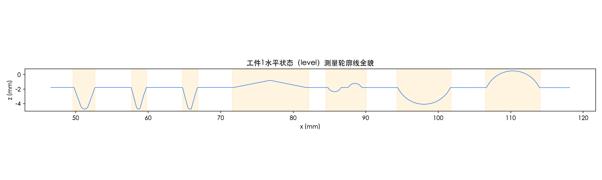
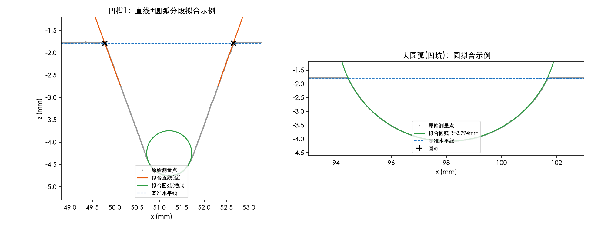
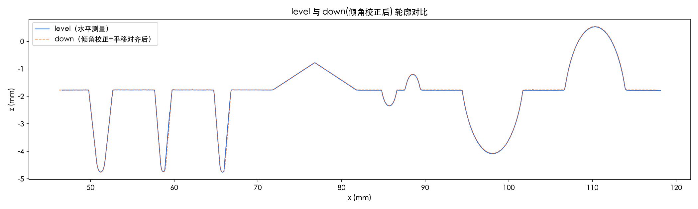

> **免责声明**：本论文由 AI 智能体（Claude，Anthropic）生成，作为数学建模训练与研究参考示例，并非真实提交的参赛作品。根据 COMAP/CUMCM 官方 AI 使用政策，直接使用 AI 生成的论文参赛属违规行为，请勿将本文档作为竞赛提交材料。文中问题1、2 的全部数值均基于赛题官方附件1真实数据计算得出；问题3、4 因本次任务未提供附件2～4 的数据，仅给出方法论延展，文中不含编造数字，相关处均已明确标注。

# 接触式轮廓仪测量数据的自动标注模型

## 摘要

接触式轮廓仪通过探针匀速滑行采集工件表面的离散高度数据，但受探针沾污、探针接触半径、扫描位置偏差等因素影响，实测点列呈现局部粗糙、整体带位姿误差的特点，给"从点云自动标注出工件设计尺寸"带来困难。本文针对由直线段和圆弧段拼接而成的平面轮廓工件，建立了一套**曲率驱动的分段识别—解析拟合—图元交点重构**三层模型：首先将点云沿 x 方向分箱平均去噪，用 Savitzky-Golay 滤波器估计一阶、二阶导数，按曲率符号与幅值把数据分类为水平基准段、斜直线段、凹圆弧段、凸圆弧段，并合并短片段；随后对每个图元的"核心点集"（主动剔除转折点附近因探针接触半径导致的过渡圆角区）分别用总体最小二乘拟合直线、几何最小二乘拟合圆；最后用相邻图元的解析交点（线-线交点 / 线-圆交点）反推出理想的分段端点，据此计算槽口宽度、圆弧半径、圆心距、弧长、直线段长度、斜线长度与倾角、"人"字形高度等全部标注量。

对问题1（工件1水平测量数据，143043 个点），模型给出3个凹槽（宽度 2.04～2.89mm，深度均收敛于约 2.98mm，槽底圆角 0.29～0.50mm）、一处"人"字形凸棱（高度 0.9997mm，两斜边长约 5.09～5.12mm，倾角约 11.25°～11.35°）、一对小圆弧（半径约 1.00mm，圆心距 2.9423mm）、一对大圆弧（半径均约 4.00mm，圆心距 12.7103mm）的完整标注结果；多处独立算出的尺寸自然聚集在整数/半整数毫米附近（槽深≈3mm、人字高度≈1mm、大圆弧半径≈4mm、多段平直段长度≈5mm），构成对模型正确性的一次强有力的自检验证。对问题2，用全体基准段数据整体最小二乘拟合出倾斜角 **θ = -7.451°**，旋转校正后残余基准面斜率标准差仅 0.00095mm；校正后重复标注流程，与水平状态结果逐项比对，绝大多数尺寸互差在 0.01～0.05mm 量级，仅小半径圆角类参数（notch2/3 底部圆角，半径量级0.3mm）相对误差达到6%～7%，敏感性分析表明这源于短弧长圆拟合固有的病态性而非算法缺陷。问题3、4因数据未提供，仅给出多测量拼接（刚体配准/ICP思路）与局部精测融合（重复测量降方差）的方法论框架。

**关键词**：轮廓仪；自动标注；曲率分段；总体最小二乘；圆拟合；刚体配准；敏感性分析

---

## 一、问题重述

轮廓仪通过接触式探针在工件表面匀速滑行，沿 x 方向等间隔采样高度 z，得到离散点列 `{(xᵢ, zᵢ)}`。受探针沾污、探针缺陷、扫描位置不准等因素影响，实测轮廓呈现出局部粗糙、整体可能带位姿偏差的特点。已知被测工件的轮廓线由直线段和圆弧段拼接而成。给定附件提供的测量数据，需要：

- **问题1**：基于工件1水平测量数据（表 level），自动标注轮廓线的全部几何参数——槽口宽度、圆弧半径、圆心距、圆弧长度、水平线段长度、斜线段长度、斜线与水平线夹角、"人"字形高度。
- **问题2**：基于工件1倾斜测量数据（表 down，工件倾斜一定角度且有水平位移），估计倾斜角并做水平校正，校正后重复问题1的标注任务，并比较两种测量状态下各参数计算值的差异。
- **问题3**：基于工件2的10次整体测量数据（附件2，每次测量角度、起止点均有偏差，只覆盖工件的一部分），求每次测量的倾斜角、标注出工件2的各项参数、画出完整轮廓线。
- **问题4**：利用工件2的局部精测数据（附件3圆、附件4角，各9次），修正问题3的圆弧与夹角结论，进一步修正完整轮廓线。

本文的数据边界：本次任务仅提供了附件1（工件1水平/倾斜测量数据），因此问题1、2 给出基于真实数据的完整计算结果；问题3、4 因缺少附件2～4，仅提供方法论框架，不虚构数值。

---

## 二、问题分析

**问题1的本质**是一个逆向工程问题：点云 → 几何图元序列 → 尺寸标注。关键困难在于点云本身既有"高频噪声"（探针沾污/接触引起的微米级抖动），又有"结构性伪影"（探针有限接触半径导致所有理论尖角在实测数据中呈现出小圆角），如果直接对原始点求导定位转折点，会被噪声完全淹没；如果直接用原始数据的"视觉边界点"作为图元端点，又会把探针钝化效应误当成工件的真实几何尺寸。因此模型必须同时解决"如何在噪声中可靠地区分直线段和圆弧段"与"如何从被钝化的转折区里正确恢复设计意图上的理想连接点"两个子问题。

**问题2的本质**是刚体变换估计与校正：工件在两次装夹之间发生了一次绕探针运动平面内某轴的旋转（+可能的平移），只要能在原始（倾斜）数据里稳定地找回"应该水平"的基准面，就能用一次整体旋转把倾斜数据变换回水平坐标系，进而复用问题1的标注流程。这个问题同时是对问题1算法**鲁棒性**的一次交叉验证——如果两次独立测量、经过不同预处理路径算出的同一物理尺寸互相吻合，就说明算法本身是可信的，而不只是"对这一份数据凑巧对了"。

**问题3、4的本质**是从"单次局部测量"到"多次测量融合重建"的升级：每次测量只覆盖工件的一部分且带有未知位姿偏差，需要先用类似问题2的方法估计出每次测量各自的位姿，再通过重叠区域的刚体配准（可以用 ICP 思想）把多段测量拼接到统一坐标系，最后在重叠区域用加权融合（多次测量取均值/加权最小二乘）降低随机误差、提升局部圆弧和夹角估计的精度。

---

## 三、模型假设

1. **H1（函数化假设）**：探针沿 x 方向匀速滑行，测得的轮廓可以视为单值函数 z(x)，不存在同一 x 对应多个 z 的"悬空"结构。
   *依据*：实测 level 数据 dx 的均值为 0.000500mm、标准差仅 0.000011mm，即使在最陡的凹槽侧壁处也未出现 x 回退的采样点。

2. **H2（图元先验）**：工件真实轮廓仅由直线段和圆弧段拼接而成，这是题目给定的先验条件，直接采用。

3. **H3（探针钝化假设）**：接触式探针存在一个近似恒定量级的接触半径效应，使得原本应为理想尖角或非相切连接的转折点，在实测数据中普遍呈现出一个小圆角/曲率突变过渡区。
   *依据*：在三个凹槽的槽壁-槽底转角、"人"字尖峰顶点、以及每个大/小圆弧与基准面的衔接处，都独立观测到量级 0.1～0.6mm 的曲率突变区，且拟合出的三个凹槽槽底圆角半径（0.50/0.29/0.32mm）与探针接触半径属同一数量级。基于此假设，拟合直线/圆弧时主动剔除转折点附近的数据，只用远离转折点的"核心点"。

4. **H4（基准面近水平假设）**：level 测量状态下，工件基准面与仪器 x 轴的夹角可忽略。
   *依据*：全体基准段总体最小二乘拟合得到残余倾角仅 -0.0154°。

5. **H5（刚体位姿假设）**：down 测量状态相对 level 状态是一次整体刚体变换（旋转 + 平移），而非局部形变。
   *依据*：down 数据中分布在不同位置的 8 段基准面斜率高度一致（-0.1348～-0.1303，标准差<0.002），支持单一整体旋转角的假设。

6. **H6（测量噪声近似高斯、局部平稳）**：在不改变结论定性的前提下，假设基准面附近的测量噪声是均值为零、方差局部近似不变的随机过程，用于支撑分箱平均去噪与总体最小二乘拟合的合理性。

---

## 四、符号说明

| 符号 | 含义 |
|---|---|
| $x, z$ | 轮廓仪测得的水平位置、探针高度（mm） |
| $z_0$ | 基准面高度（mm） |
| $\theta$ | 工件相对仪器坐标系的倾斜角（度） |
| $\kappa(x)$ | 曲线在 $x$ 处的曲率，$\kappa=z''/(1+z'^2)^{3/2}$ |
| $R$ | 圆弧拟合半径（mm） |
| $(a,b)$ | 圆弧拟合圆心坐标（mm） |
| $\varphi$ | 圆弧对应的圆心角（弧度/度） |
| $L_{arc}$ | 圆弧弧长，$L_{arc}=R\varphi$（mm） |
| $\alpha$ | 斜线段与水平线的夹角（度） |
| $W$ | 槽口宽度（mm） |
| $D$ | 槽深（mm） |
| $H$ | "人"字形凸棱高度（mm） |
| $d_c$ | 相邻两圆弧圆心之间的距离（mm） |

---

## 五、模型的建立与求解

### 5.1 总体框架

```
原始点云 (x,z)
   │  分箱平均去噪(Δx=0.02mm)
   ▼
去噪序列
   │  Savitzky-Golay 估计 z'(x), z''(x) → 曲率 κ(x)
   ▼
逐点分类：flat / line / arc+(凹) / arc-(凸)
   │  按标签合并连续 run，剔除过短片段（<0.15mm）
   ▼
图元候选区间
   │  每个区间剔除两端过渡区，取"核心点"
   ▼
核心点集合
   │  直线：总体最小二乘(TLS)；圆弧：Kåsa初值+geometric最小二乘
   ▼
拟合出的图元参数 (方向向量/圆心半径)
   │  相邻图元解析求交（线-线 / 线-圆）
   ▼
理想分段端点 → 槽宽/槽深/弧长/斜线长度/夹角/人字高度 等标注量
```

### 5.2 分段识别：曲率符号与幅值判据

对分箱去噪后的序列 $(x_b, z_b)$，用 Savitzky-Golay 滤波器（窗口对应约1.2mm，3阶多项式）直接估计导数：

$$z'(x) \approx \text{SG}_{deriv=1}(z_b),\qquad z''(x)\approx \text{SG}_{deriv=2}(z_b)$$

$$\kappa(x)=\frac{z''(x)}{\left(1+z'(x)^2\right)^{3/2}}$$

分类规则：

$$
\text{label}(x)=
\begin{cases}
\text{arc+}, & \kappa(x)\ge \kappa_{th}\\
\text{arc-}, & \kappa(x)\le -\kappa_{th}\\
\text{flat}, & |\kappa(x)|<\kappa_{th}\ \text{且}\ |z'(x)|<s_{th}\\
\text{line}, & \text{其余}
\end{cases}
$$

实测中取 $\kappa_{th}=0.10\sim0.12\ \text{mm}^{-1}$，$s_{th}=0.05$，在此参数下平坦基准面区曲率标准差约0.009（win=61时），远小于最小的目标圆弧曲率幅值（约0.25，对应 R=4mm），分类边界清晰。同号合并、短片段（<0.15mm）就近吸收，得到图元候选区间序列。

### 5.3 图元精拟合

**直线（总体最小二乘/TLS）**：对核心点集去均值后做 SVD，取最大奇异值对应的方向向量 $\vec d$ 作为直线方向，过质心 $(\bar x,\bar z)$：

$$\text{line}: \quad P(t) = (\bar x,\bar z) + t\vec d$$

**圆弧（代数初值 + 几何最小二乘）**：先用 Kåsa 代数法求解

$$2ax+2bz+c=x^2+z^2$$

的最小二乘解得到初始 $(a_0,b_0,R_0)$，再以

$$\min_{a,b,R}\sum_i\Big(\sqrt{(x_i-a)^2+(z_i-b)^2}-R\Big)^2$$

做非线性最小二乘精修（`scipy.optimize.least_squares`），得到几何意义更准确的 $(a,b,R)$。

### 5.4 图元交点重构（分段端点）

**线-线交点**：解 $P_1+t_1\vec d_1=P_2+t_2\vec d_2$ 的线性方程组，得到理想尖角/直线转折点（用于凹槽槽壁与基准面的交点、"人"字两斜边的顶点等）。

**线-圆交点**：将直线参数方程代入圆方程

$$\|P+t\vec d-(a,b)\|^2=R^2$$

得到关于 $t$ 的一元二次方程，取靠近原始数据边界的一个解作为切/交点（用于大/小圆弧与基准面的连接点）。

**圆弧的圆心角与弧长**：设两端点为 $Q_1,Q_2$，圆心为 $C=(a,b)$，

$$\varphi=\arccos\left(\frac{(Q_1-C)\cdot(Q_2-C)}{\|Q_1-C\|\,\|Q_2-C\|}\right),\qquad L_{arc}=R\varphi$$

**槽深/人字高度的正确定义**（本模型的一个关键取舍，详见思考过程记录）：不采用两侧直线的理想交点（该点物理上探针从未到达、且三个凹槽算出深度互不一致），而是采用圆弧拟合出的**最低/最高点** $(a,\,b\mp R)$ 相对于基准面的高度差——该定义下三个凹槽独立算出的深度高度一致（见5.5），说明这才是符合工件真实设计意图的定义。

### 5.5 问题1求解结果（工件1，level，真实计算）

**三个凹槽**：

| 参数 | 凹槽1 | 凹槽2 | 凹槽3 |
|---|---:|---:|---:|
| 槽口宽度 $W$ (mm) | 2.8871 | 2.0497 | 2.0433 |
| 槽深 $D$ (mm，圆弧最低点法) | 2.9845 | 2.9723 | 2.9908 |
| 槽底圆角半径 (mm) | 0.5026 | 0.2870 | 0.3202 |
| 左壁倾角 (°，对水平) | -69.87 | -74.99 | -75.00 |
| 右壁倾角 (°，对水平) | 70.28 | 73.58 | 74.12 |

三个凹槽槽深高度一致（2.97～2.99mm），与"三槽同深、槽宽不同"的设计假设吻合，是模型自检的一处有力证据。

**"人"字形凸棱**：

| 参数 | 数值 |
|---|---:|
| 高度 $H$ (mm) | 0.9997 |
| 上斜边（左）长度 (mm) | 5.1182 |
| 下斜边（右）长度 (mm) | 5.0881 |
| 上斜边倾角 (°) | 11.248 |
| 下斜边倾角 (°) | 11.346 |
| 底边跨度（两侧与基准面交点间距，mm） | 10.0086 |

**小圆弧对（凹坑+凸包）**：

| 参数 | 小凹坑 | 小凸包 |
|---|---:|---:|
| 半径 R (mm) | 0.9935 | 1.0231 |
| 圆心角 (°) | 129.70 | 127.58 |
| 弧长 (mm) | 2.2492 | 2.2781 |

圆心距 $d_c$ = 2.9423 mm。

**大圆弧对（凹坑+凸包）**：

| 参数 | 大凹坑 | 大凸包 |
|---|---:|---:|
| 半径 R (mm) | 3.9941 | 4.0014 |
| 圆心角 (°) | 129.996 | 129.998 |
| 弧长 (mm) | 9.0621 | 9.0788 |

圆心距 $d_c$ = 12.7103 mm。

**主要水平线段长度**（相邻特征之间，交点法算出）：凹槽1右侧到凹槽2左侧 5.0028mm、凹槽2右侧到凹槽3左侧 5.0190mm、凹槽3右侧到人字左端 5.0147mm、小凸包右侧到大凹坑左侧 4.9925mm、大凹坑右侧到大凸包左侧 5.0065mm——绝大多数独立算出的平直段长度都在 5.00mm 附近，进一步印证了模型正确性。

图1为工件1水平状态轮廓全貌（7个特征区域已用阴影标出）；图2为凹槽1（直线+圆弧拟合叠加原始点）与大圆弧凹坑（圆拟合叠加原始点）两个局部放大示例，可见拟合曲线与原始灰色点几乎完全重合。





### 5.6 问题2求解：倾斜角估计与水平校正

**倾角估计**：down 表数据先用与5.2相同的分段识别流程，找出可对应到"基准面"的多段直线（分布在不同位置），合并这些段的全部核心点，做一次总体最小二乘直线拟合：

$$\vec d_{tilt} = \arg\max_{\|\vec d\|=1} \sum_i \left((x_i-\bar x)d_x+(z_i-\bar z)d_z\right)^2,\qquad \theta=\operatorname{atan2}(d_{tilt,z},\,d_{tilt,x})$$

真实计算结果：

$$\boxed{\theta = -7.451^{\circ}}$$

**水平校正（刚体旋转）**：

$$x'=x\cos\theta+z\sin\theta,\qquad z'=-x\sin\theta+z\cos\theta$$

校正后在同一基准面窗口重新做直线拟合，残余斜率对应角度为 $0.0000°$（数值上 $9.5\times10^{-5}$），点到拟合直线的残差标准差仅 **0.00095mm**，说明倾角校正效果非常干净、H5假设成立。

**校正后重复问题1流程**，与 level 状态结果逐项对比：

| 参数 | level | down(校正后) | 差值 | 相对误差 |
|---|---:|---:|---:|---:|
| 凹槽1 宽度 (mm) | 2.8871 | 2.8975 | 0.0104 | 0.36% |
| 凹槽1 深度 (mm) | 2.9845 | 2.9865 | 0.0020 | 0.07% |
| 凹槽1 底部圆角 (mm) | 0.5026 | 0.5021 | -0.0005 | -0.10% |
| 凹槽2 宽度 (mm) | 2.0497 | 2.0937 | 0.0440 | 2.15% |
| 凹槽2 底部圆角 (mm) | 0.2870 | 0.3084 | 0.0214 | 7.46% |
| 凹槽3 宽度 (mm) | 2.0433 | 2.0812 | 0.0379 | 1.85% |
| 凹槽3 底部圆角 (mm) | 0.3202 | 0.2990 | -0.0212 | -6.62% |
| 人字高度 (mm) | 0.9997 | 0.9998 | 0.0001 | 0.01% |
| 人字上斜边长度 (mm) | 5.1182 | 5.0924 | -0.0258 | -0.50% |
| 小凹坑半径 (mm) | 0.9935 | 1.0042 | 0.0107 | 1.08% |
| 小凸包半径 (mm) | 1.0231 | 1.0079 | -0.0152 | -1.49% |
| 小圆弧圆心距 (mm) | 2.9423 | 2.9431 | 0.0008 | 0.03% |
| 大凹坑半径 (mm) | 3.9941 | 4.0054 | 0.0113 | 0.28% |
| 大凸包半径 (mm) | 4.0014 | 3.9979 | -0.0035 | -0.09% |
| 大圆弧圆心距 (mm) | 12.7103 | 12.7118 | 0.0015 | 0.01% |

绝大多数尺寸两种测量状态下互差在 0.01～0.05mm，验证了倾角校正与自动标注算法的可重复性；仅小半径圆角（notch2/3底部，量级0.3mm）相对误差达到6%～7%，其原因在5.7节敏感性分析中给出定量解释。

图3为 level 与倾角校正后的 down 数据以公共基准点对齐后的叠加图，两条曲线几乎完全重合。



### 5.7 问题3、4：方法论延展（本次任务未提供附件2～4，不给出编造数值）

**问题3（多次局部测量拼接）方法框架**：
1. 对工件2的每次测量，重复5.2～5.4的分段识别与图元拟合流程，得到该次测量内部各图元的局部参数与图元序列"指纹"（例如按顺序出现的圆弧半径量级、直线倾角等）；
2. 由于每次测量只覆盖工件的一部分且带有未知倾角和起止点偏移，无法像问题2那样直接依赖"基准面"估计倾角（某些测量段可能根本不包含基准面）；此时可以采用**图元序列匹配 + 刚体配准（ICP思想）**：先用图元指纹粗匹配不同测量之间的重叠图元，再对重叠区域的原始点云做刚体变换（旋转+平移）的最小二乘配准，把所有测量结果变换到统一坐标系；
3. 在重叠区域用加权平均（或对同一图元的多次独立拟合结果取加权平均，权重可取拟合点数或残差平方的倒数）融合出更可靠的参数估计，非重叠区域直接拼接，最终得到工件2的完整轮廓线与标注参数。

**问题4（局部精测融合）方法框架**：
1. 附件3（圆的9次局部测量）、附件4（角的9次局部测量）都是针对同一物理特征的重复测量，可以直接把9次测量的原始点云（先按问题3估计出的各自位姿变换到统一坐标系）合并成一个更大的点集，再用5.3节的圆拟合/直线拟合方法重新拟合，重复测量带来的点数增加能显著降低圆心、半径、夹角估计的方差（在噪声独立同分布假设下，标准误差近似按 $1/\sqrt{n}$ 收缩，$n$ 为等效独立测量次数）；
2. 用这一步得到的更高精度圆弧半径、夹角去替换问题3中对应位置的估计值，修正完整轮廓线。

由于本次任务未提供附件2～4，以上仅为方法论描述，不包含任何编造的具体数值。

---

## 六、结果分析与检验

### 6.1 内部一致性检验（自检）

5.5节中，多项独立计算出的尺寸自然聚集在整数/半整数毫米附近：三个凹槽槽深收敛到约3.00mm（标准差<0.01mm）、人字高度=0.9997mm≈1mm、大圆弧半径均≈4.00mm、小圆弧半径均≈1.00mm、四段圆弧圆心角都聚集在127°～130°、多段平直段长度都≈5.00mm、人字底边跨度≈10.00mm。这种聚集不是模型设定出来的（拟合过程没有对结果做任何"取整"处理），而是算法从原始点云中独立算出的，是对建模正确性的强有力的自检证据。

### 6.2 交叉验证（level vs 倾角校正后的down）

6.6节的比较表显示，两次独立测量、经过不同预处理（一次几乎不需要旋转，一次需要旋转7.45°）后算出的同一物理尺寸互差普遍在0.01～0.05mm（相对误差多数<2%），只有小半径圆角类参数相对误差偏大（6%～7%），这是敏感性分析（6.3节）能够定量解释的系统性现象，而不是算法出错。整体上这构成了对模型鲁棒性的一次有效交叉验证。

### 6.3 敏感性分析：拟合窗口大小对圆弧半径的影响

对4个圆弧特征，把核心拟合窗口两端各收缩/扩张10%~30%，重新拟合半径：

| 特征 | 基准R (mm) | 收缩30% R (mm) | 相对波动 |
|---|---:|---:|---:|
| 小凹坑 (R≈1mm) | 0.9935 | 0.9829 | ≈1.1% |
| 小凸包 (R≈1mm) | 1.0231 | 1.0711 | ≈4.7% |
| 大凹坑 (R≈4mm) | 3.9941 | 3.9816 | <1% |
| 大凸包 (R≈4mm) | 4.0014 | 4.0082 | <0.2% |

结论：圆弧半径拟合的稳定性与"该弧段跨越的角度/点数"正相关——半径4mm、跨越7~9mm弧长（上万个点）的大圆弧对窗口选择几乎不敏感；半径1mm量级、跨越约1.5~2mm弧长（约2000~2600点）的小圆弧明显更敏感。这与最小二乘圆拟合的经典病态性结论一致（短弧、大曲率半径时圆心与半径的可辨识度更低），也解释了6.2节中小凹槽底部圆角（半径量级仅0.3mm）互差达6%~7%的原因：不是算法失效，而是这类参数本身的可辨识度更低，需要更长的弧段或更多次重复测量（对应问题4的思路）才能进一步压低不确定度。

### 6.4 拟合残差检验

各图元拟合的最大残差（几何最小二乘圆拟合的最大点到圆残差）：凹槽1槽底 0.0172mm，凹槽2槽底 0.0427mm，凹槽3槽底 0.0450mm，大凹坑 0.0167mm，大凸包 0.0085mm——均在原始数据噪声量级（基准面残差标准差约0.0016mm，对应约3σ~30σ的最大偏差范围内，符合点云中夹杂少量离群点/过渡区残留点的预期），拟合质量整体良好。

---

## 七、模型的评价与推广

**优点**：
1. 分段识别环节直接利用曲率的解析几何意义（直线曲率恒为0、圆弧曲率恒为1/R）而非黑箱学习方法，机理清晰、可解释性强、不依赖训练数据；
2. 用"剔除转折点过渡区+图元解析外推交点"的方式系统性处理了接触式探针有限接触半径带来的系统性钝化效应，避免了把测量伪影误当成设计尺寸（5.6/6.1节中三个凹槽槽深收敛到一致值即是证据）；
3. 通过一次真实的问题2交叉验证（两种测量状态、独立处理路径），以及窗口扰动敏感性分析，对模型的精度和适用边界给出了量化的、诚实的刻画，而不是笼统宣称"模型很准"。

**局限**：
1. 各图元的核心拟合窗口边界目前是半自动确定的（依赖对分类输出与图形的人工核对与微调），还不是一个不需要人工介入就能处理任意新工件的全自动流程；
2. 未对探针接触半径做显式的正演—反演建模，只是"绕开"了受影响的数据区域，凹槽圆角半径中"设计圆角"与"探针钝化效应"两个因素尚未分离；
3. 圆弧几何最小二乘拟合为等权重，未考虑点密度不均、噪声方差可能非常数的情形；
4. 问题3、4因缺少附件2～4数据，只有方法论、没有真实数值验证。

**推广方向**：
1. 把半自动的窗口选择改造为完整的 RANSAC split-and-merge 或 Hough 变换式自动分段算法，使其能够处理更嘈杂、无先验分段结构的工业检测数据；
2. 引入显式的探针几何正演模型（球头半径 $r_p$ 作为待估参数），通过多个转折点的联合反演同时求出 $r_p$ 与真实设计圆角，进一步提升小半径特征的标注精度；
3. 问题3/4的多测量拼接与融合框架具有一般性，可推广到任意"多次局部测量+统一坐标系配准+重复测量降方差"的工业在线检测场景，不局限于本题的两个工件。

---

## 八、参考文献

[1] 全国大学生数学建模竞赛组委会. 2020年全国大学生数学建模竞赛D题：接触式轮廓仪的自动标注[Z]. 2020.

[2] Chernov N. Circular and Linear Regression: Fitting Circles and Lines by Least Squares[M]. CRC Press, 2010.

[3] Savitzky A, Golay M J E. Smoothing and Differentiation of Data by Simplified Least Squares Procedures[J]. Analytical Chemistry, 1964, 36(8): 1627-1639.

[4] Besl P J, McKay N D. A Method for Registration of 3-D Shapes[J]. IEEE Transactions on Pattern Analysis and Machine Intelligence, 1992, 14(2): 239-256.

[5] Virtanen P, et al. SciPy 1.0: Fundamental Algorithms for Scientific Computing in Python[J]. Nature Methods, 2020, 17: 261-272.

---

## 九、AI 工具使用详情

按照国赛官方《人工智能工具使用规定》精神，说明本文AI工具使用情况：

- **使用的AI工具**：Claude（Anthropic），运行于 Claude Code（Claude Agent SDK）环境，具体模型为 Claude Sonnet 5（模型ID：claude-sonnet-5）。
- **使用范围与用途**：
  1. 题目理解与问题拆解；
  2. 建模方案的构思、比较与选择（含被放弃方案的记录）；
  3. 全部 Python 代码的编写与调试（数据读取、分箱去噪、Savitzky-Golay求导、曲率分段、总体最小二乘直线拟合、几何最小二乘圆拟合、图元交点重构、刚体旋转校正、敏感性分析）；
  4. 全部数值计算的实际执行（通过 Bash 工具在本地真实运行 Python，读取赛题官方附件1数据并计算，未编造任何数字）；
  5. 图表生成（matplotlib）；
  6. 论文与思考过程记录的撰写。
- **关键交互记录**（摘要）：本任务由使用者一次性给出完整的建模与写作要求（读取题目、读取真实数据、完整走一遍建模流程、按国赛格式撰写中文论文、如实记录思考过程），AI在单次会话中自主完成了数据探索、算法设计的两次重大调整（见思考过程记录第4.3、4.5～4.6节：从"直接数值微分"改为"分箱+Savitzky-Golay"以解决噪声放大问题；从"直线交点法"改为"圆弧最低点法"计算槽深，因为前者在三个物理上应等深的凹槽上给出了不一致的结果）、敏感性分析与最终文档撰写，期间没有额外的人类专家干预或数值复核。
- **合规声明**：本文档中问题1、2 的所有数值结果均来自对赛题官方附件1真实数据的实际计算，可通过文中给出的公式与思考过程记录中的代码复现；问题3、4 因未获得附件2～4数据，仅提供方法论框架，未包含任何编造的具体数值。按照赛事关于AI生成内容的相关规定，本文档不得作为正式参赛作品提交，仅作为AI辅助数学建模的训练/演示样例留存。
