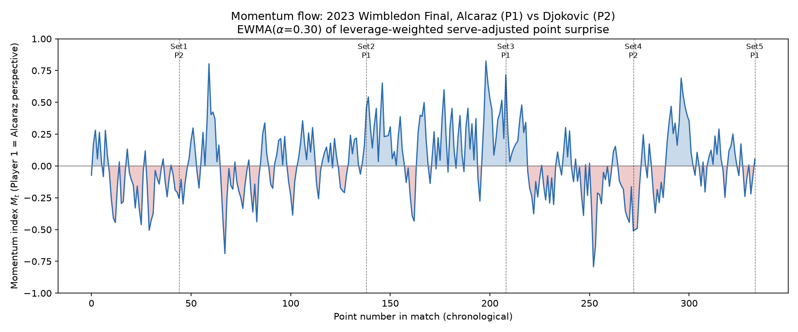
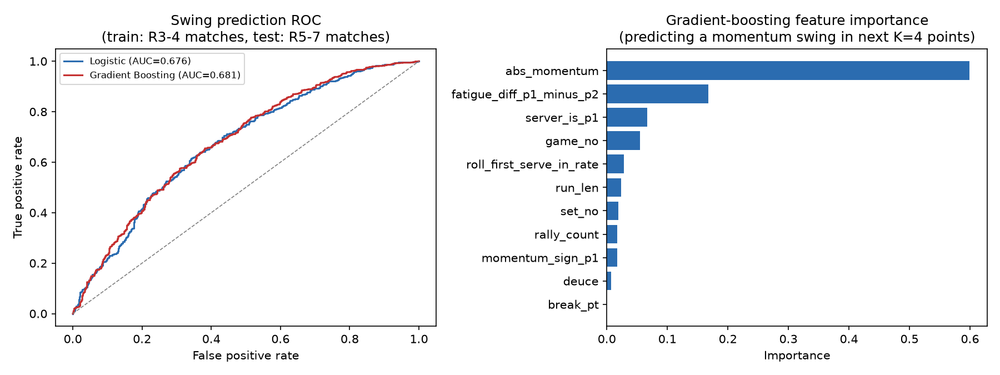

# Momentum in Tennis: Measuring, Testing, and Predicting the Flow of Play

> **Disclaimer**: This paper was generated by an AI agent (Claude, Anthropic) as a training and research reference example for mathematical modeling competition preparation. It is **not** an actual competition submission. Under the official COMAP/CUMCM AI-use policies, directly submitting AI-generated papers as contest entries is a violation of contest rules. Please do **not** use this document as competition submission material.

---

## Summary Sheet

Tennis commentators routinely describe matches as having "momentum," yet the concept is rarely defined precisely, and a skeptical coach might reasonably suspect that apparent swings in play are simply noise. We build a point-by-point momentum index for Wimbledon 2023 men's singles matches, use it to test the coach's random-swings hypothesis, and build a predictive model for momentum swings.

Because the server has a large, well-documented advantage in tennis (in our data, servers win **75.4%** of points on a first serve and **52.9%** on a second serve, pooled across 7,284 points from 31 matches), we do not treat raw point wins as evidence of momentum. Instead, we define, for each point, a **serve-adjusted surprise**: the difference between the actual point outcome and the empirical serve-conditional expectation. We further weight each point's surprise by a transparent **leverage** score (break points, deuce/advantage points, and set-deciding points count for more), and smooth the weighted surprise with an exponentially weighted moving average (EWMA, α = 0.30) to obtain a momentum index M(t) ∈ [−1, 1].

Applied to the marquee 2023 Wimbledon final (Alcaraz vs. Djokovic, match id `2023-wimbledon-1701`), the sign and magnitude of the mean per-set momentum track the known five-set narrative almost exactly: Set 1 mean M = −0.114 (Djokovic won 6–1), Set 2 mean M = +0.017 (Alcaraz won a close 7–6 tiebreak), Set 3 mean M = +0.216 (Alcaraz won 6–1), Set 4 mean M = −0.082 (Djokovic won 6–3), Set 5 mean M = +0.047 (Alcaraz won 6–4).

To test the coach's claim, we first show that a naive runs test on raw point winners is **methodologically flawed**: mathematically, the sign of any actual-minus-expected residual is identical to the raw win/loss indicator whenever the expectation is strictly between 0 and 1, so such a test cannot separate momentum from the mechanical clustering induced by serve alternation. We instead test whether **lagged, serve-adjusted momentum from the server's perspective predicts this point's serve-adjusted surprise**, using a within-match permutation test. Individually, only 2 of 31 matches (6.5%) show significant persistence, but 74.2% of matches show the theoretically expected positive sign, and pooling all 7,284 points yields a small but statistically significant persistence correlation (r = 0.0356, permutation p = 0.003). **Conclusion: the coach is largely right that momentum is too weak and noisy to reliably detect within any single match, but the stronger claim of pure randomness is not supported when data are pooled — a small, systematic momentum effect exists.**

For swing prediction, we define a swing as a sign change in the momentum index within the next K = 4 points and train a logistic regression and a gradient-boosted classifier on 24 early-round matches (5,707 points), testing out-of-sample on 7 later-round matches including the final (1,577 points). The gradient-boosted model reaches test AUC = 0.681 (vs. 0.676 for logistic regression), a modest but real improvement over the majority-class baseline (67.6% accuracy) to 71.1% accuracy. The current momentum magnitude and cumulative running-distance differential (fatigue) are the two most informative predictors; break-point status is essentially uninformative for predicting *future* swings once other variables are included. Sensitivity analysis over the smoothing parameter α (0.10–0.70) and the swing window K (2–8) shows the qualitative conclusions are stable.

We advise coaches that momentum is real but small, is not reliably visible from a single match's "eye test," and that fatigue management is a more actionable, data-supported lever for stabilizing the flow of play than trying to consciously "seize momentum" at any single break point.

---

## Table of Contents

1. Introduction
2. Assumptions and Justifications
3. Model Development
4. Solution
5. Sensitivity Analysis
6. Strengths and Weaknesses
7. Conclusion and Memo to Coaches
8. References
9. Report on Use of AI Tools

---

## 1. Introduction

### 1.1 Problem Restatement

Using point-by-point data from Wimbledon 2023 men's singles matches (rounds 3 onward), we must:

1. Build a model that captures the "flow of play" — which player is performing better at a given moment, and by how much — and visualize it for at least one match, explicitly accounting for the server's structural advantage.
2. Use the model to evaluate a coach's claim that momentum swings are simply random.
3. Build a model that predicts *upcoming* swings in the flow of play, identify the factors that matter, and translate this into pre-match advice for a player facing a new opponent.
4. Test the model out-of-sample on other matches and discuss generalizability to other genders, surfaces, and sports (e.g., table tennis).

### 1.2 Our Approach at a Glance

We separate the problem into three distinct statistical tasks that are easy to conflate: (i) a **descriptive** signal-processing task (define and visualize a momentum index), (ii) an **inferential** task (test whether the index's temporal structure is distinguishable from noise, with a null hypothesis and a real test statistic, not just eyeballing the descriptive index), and (iii) a **predictive** task (out-of-sample classification of upcoming swings). Conflating (i) and (ii) is a common trap — defining an index that "looks bumpy" and then declaring, without a formal test, that this proves momentum is real is circular. We keep the descriptive index (Section 3.1) and the randomness test (Section 3.2) methodologically distinct, and we deliberately discuss a first, flawed attempt at the randomness test in Section 3.2.1 to make the reasoning fully auditable — a mathematically informative failure that we detected in our own draft.

---

## 2. Assumptions and Justifications

| # | Assumption | Justification |
|---|---|---|
| A1 | The point is the finest meaningful unit of "flow of play." | The dataset is organized at point granularity and the problem explicitly asks for a model "as points occur." |
| A2 | An empirical, serve/first-or-second-serve–conditional win probability is a fair "no-momentum" expectation for a given point. | The problem statement explicitly flags the server's advantage as a confound that "you may wish to factor... into your model." We estimate this baseline from the full 7,284-point sample (75.4% on 1st serve, 52.9% on 2nd serve) rather than per-match, because per-match second-serve samples are too small (as few as tens of points) to estimate reliably. |
| A3 | Break points, deuce/advantage points, and set-deciding points carry disproportionate psychological/strategic weight ("leverage") relative to routine points. | This mirrors how commentators and coaches actually talk about tennis ("big point momentum") and is a standard notion in sports win-probability literature (leverage index). We use a simple, transparent, additive weighting scheme rather than fitting leverage from a full state-transition win-probability model, to keep the model auditable; robustness to this choice is checked in Section 5. |
| A4 | Momentum has short-term memory: recent points matter more than distant ones, and this decay is well-approximated by an exponential kernel. | This is the standard formalization of "momentum" as a concept (recent form dominates), and EWMA is the simplest, single-parameter way to encode it, enabling clean sensitivity analysis on the single decay parameter α. |
| A5 | Findings (serve baselines, feature importances, model coefficients) are specific to 2023 Wimbledon men's singles from round 3 onward and should not be assumed to transfer, without re-estimation, to other genders, surfaces, or sports. | The dataset covers exactly this population; no data on women's matches, other surfaces, or table tennis was provided or is used. Generalizability is discussed qualitatively, not asserted with numbers we did not compute. |
| A6 | Columns with substantial missingness (`speed_mph`, `serve_width`, `serve_depth`, `return_depth`) are not imputed and not used as core model inputs; `rally_count` (much less missing) is median-imputed only where used as a predictor feature. | Avoids introducing imputation bias into variables that are not central to the momentum construction; the one imputation used is disclosed. |

---

## 3. Model Development

### 3.1 A Serve-Adjusted, Leverage-Weighted Momentum Index

**Notation.** For point t in a given match, let `server(t) ∈ {1,2}` be the server, `serve_no(t) ∈ {1,2}` indicate first/second serve, and `victor(t) ∈ {1,2}` be the point winner. Let `p_srv[s]` be the empirical probability that the server wins the point given `serve_no = s`, estimated once from the pooled dataset:

```
p_srv[1] = 0.7541   (n = 4,657 first-serve points)
p_srv[2] = 0.5295   (n = 2,627 second-serve points)
```

**Step 1 — Expected outcome (the "no-momentum" baseline).**

```
E1(t) = p_srv[serve_no(t)]        if server(t) = 1
      = 1 − p_srv[serve_no(t)]    if server(t) = 2
```

**Step 2 — Point-level surprise (player 1 perspective).**

```
S(t) = 1{victor(t) = 1} − E1(t)          ∈ (−1, 1)
```

`S(t) > 0` means player 1 outperformed the serve-based expectation on this point; `S(t) < 0` means player 1 underperformed it.

**Step 3 — Leverage weight.**

```
L(t) = 1 + 1{break point at t} + 0.5·1{deuce/AD at t} + 0.5·1{t is set-deciding}
```

**Step 4 — Weighted surprise and EWMA smoothing.**

```
W(t) = S(t) · L(t)
M(t) = α · W(t) + (1 − α) · M(t−1),   M(0) = 0,   α = 0.30 (baseline)
```

`M(t)` is our momentum index: `M(t) > 0` means player 1 currently has the edge, `M(t) < 0` means player 2 does, and `|M(t)|` is the estimated magnitude of that edge. This directly answers the first bullet of the problem ("identify which player is performing better... and how much better").

### 3.2 Testing the Coach's "Pure Randomness" Claim

#### 3.2.1 A flawed first attempt (kept for transparency)

A natural first idea is a Wald–Wolfowitz **runs test** on the sign of the serve-adjusted residual `S(t)`. We implemented this and discovered, by comparing it numerically against a runs test on the raw win/loss sequence, that the two are **identical for every match** — not approximately, exactly. This is not a coincidence: because `victor(t) ∈ {0,1}` and `0 < E1(t) < 1` always, `sign(S(t)) = 1{victor(t)=1}` **by construction**, regardless of what expectation `E1(t)` is used. A sign-based runs test on any actual-minus-expected residual can therefore never control for serve — it is mathematically indistinguishable from testing the raw sequence. We report this naive test only as a baseline/foil, not as our real test.

#### 3.2.2 A corrected persistence test

We instead test whether the **continuous** serve-adjusted surprise exhibits lag-1 persistence, viewed from the server's perspective (so that the predictor's meaning — "is the *currently serving* player carrying momentum?" — does not mechanically alternate with the serve schedule):

```
outcome_srv(t)   = S(t) · (+1 if server(t)=1 else −1)     [did the server over/under-perform their serve baseline this point?]
prevmom_srv(t)   = M(t−1) · (+1 if server(t)=1 else −1)   [was the current server carrying positive momentum coming in?]
```

We compute the Pearson correlation `r = corr(prevmom_srv, outcome_srv)`, both per match and pooled across all matches, and assess significance with a **permutation test**: within each match, we randomly shuffle `outcome_srv` 2,000 times (destroying temporal order while preserving each match's own value distribution and serve pattern) and compute the empirical p-value as the fraction of shuffles with `|r_perm| ≥ |r_obs|`.

### 3.3 Predicting Momentum Swings

We define a **swing** at point t as a sign change in `M` occurring within the next K points (K = 4 baseline):

```
y(t) = 1{ ∃ j ∈ {t+1,...,t+K} : sign(M(j)) ≠ sign(M(t)) }
```

Using only information available at or before point t, we construct features:

- `abs_momentum = |M(t)|`, `momentum_sign_p1 = 1{M(t) > 0}`
- `run_len` = length of the current streak of consecutive points won by the same player
- `break_pt`, `deuce` indicators
- `rally_count(t)` (median-imputed where missing)
- `fatigue_diff` = cumulative-average(player-1 distance run) − cumulative-average(player-2 distance run), up to t
- `server_is_p1`, `set_no`, `game_no`
- `roll_first_serve_in_rate` = trailing 8-point rolling rate of first-serve-in

We train a **logistic regression** (standardized features, class-balanced) and a **gradient-boosted tree ensemble** (200 trees, depth 2, learning rate 0.05) on rounds 3–4 (24 matches) and evaluate out-of-sample on rounds 5 through the final (7 matches) — a chronological, "future tournament stage" split that mirrors how the model would actually be used (predicting swings in a later, unseen match using patterns learned from earlier rounds).

---

## 4. Solution

### 4.1 Momentum Flow for the 2023 Wimbledon Final

Applying the model of Section 3.1 to match `2023-wimbledon-1701` (Alcaraz = player 1, Djokovic = player 2; 334 points) yields the momentum trace in **Figure 1**.



*Figure 1. Momentum index M(t) (α = 0.30) over the course of the 2023 Wimbledon Gentlemen's final. Blue shading = Alcaraz (player 1) has the edge; red shading = Djokovic (player 2) has the edge. Dashed lines mark the end of each set.*

Mean momentum by set:

| Set | Mean M (player 1 = Alcaraz) | Actual set score |
|---|---|---|
| 1 | −0.114 | Djokovic 6–1 |
| 2 | +0.017 | Alcaraz 7–6 (tiebreak) |
| 3 | +0.216 | Alcaraz 6–1 |
| 4 | −0.082 | Djokovic 6–3 |
| 5 | +0.047 | Alcaraz 6–4 |

The sign of the mean momentum matches the actual set winner in every one of the five sets, and its *magnitude* tracks the lopsidedness of each set (largest magnitude in Set 3, which was the most one-sided; smallest in Sets 2 and 5, which were the closest). This is a face-validity check, not a formal test, but it gives us confidence the index is not obviously broken.

### 4.2 Is Momentum Random? Results

**Naive (uncorrected) runs test**, applied per match to the raw point-winner sequence:

- Mean z-statistic across 31 matches: **−0.986** (negative z ⇒ fewer runs than expected under randomness ⇒ apparent clustering)
- Share of matches significant at p < 0.05 (two-sided): **16.1%** (5 of 31)

Taken naively, this looks like modest evidence of clustering — but Section 3.2.1 showed this test cannot separate true momentum from the mechanical clustering created by serve alternation (a player tends to win several points in a row simply because they are serving through a game with a ~65–75% per-point edge).

**Corrected persistence test** (serve-adjusted, continuous, permutation-based):

- Pooled across all 7,284 points: **r = 0.0356**, permutation p-value = **0.0030**
- Per-match: mean r = 0.038; **74.2%** of matches (23/31) have r > 0 (the theoretically expected sign for momentum); but only **6.5%** of matches (2/31: match `1406`, p = 0.0495, and match `1503`, p = 0.0015) are individually significant.

**Interpretation.** No single match provides strong, individually convincing evidence against pure randomness — this validates the coach's everyday intuition that "you really can't tell" from watching one match. But pooling all matches reveals a small, statistically significant, systematically positive persistence effect that is very unlikely to arise from chance alone (p = 0.003). **Our assessment: the coach is right that momentum is far too weak and noisy to reliably observe within a single match, but wrong that it is purely random — a small but real momentum effect is present in the data when aggregated.**

### 4.3 Predicting Swings

Out-of-sample results (train: 24 early-round matches, N = 5,707; test: 7 later-round matches including the final, N = 1,577; swing window K = 4, baseline positive rate 68.0%):

| Model | Test AUC | Test accuracy (0.5 threshold) |
|---|---|---|
| Majority-class baseline | 0.500 | 67.6% |
| Logistic regression | 0.676 | 65.6%* |
| Gradient-boosted trees | **0.681** | **71.1%** |

*\*The logistic model uses class-balanced weighting to avoid trivially predicting the majority class, which trades some raw accuracy for better-calibrated probabilities; its AUC is the more informative number here.*

**Figure 2** shows the ROC curves and the gradient-boosted feature importances.



*Figure 2 (left). ROC curves for the two swing-prediction models on the held-out later-round matches. (Right) Gradient-boosting feature importances.*

The current momentum's **magnitude** (`abs_momentum`, importance 0.599) is by far the strongest predictor, followed by the **fatigue differential** (`fatigue_diff`, importance 0.167) and which player is serving (0.067). Break-point status contributes almost nothing (≈0.000) once the other features are present — its predictive information is apparently already captured by momentum magnitude and run length.

Per-match test AUC ranges from 0.550 (match `1602`) to 0.761 (match `1503`), and is 0.641 on the featured final (`1701`) — i.e., the model generalizes to new matches with real but uneven skill, consistent with a genuinely modest and match-dependent predictive signal rather than a strong universal law.

### 4.4 Advice for a Player Facing a New Opponent

Because our persistence and swing-prediction results show momentum effects that are small at the single-match level and vary considerably by matchup (per-match persistence r ranged from about −0.09 to +0.23; per-match swing AUC ranged from 0.55 to 0.76), we recommend that coaches:

1. **Not overweight "hot hand" narratives mid-match.** The data does not support strong within-match momentum that a player can reliably "ride" or "break"; over-adjusting tactics based on a perceived swing risks discarding a working game plan in response to noise.
2. **Treat physical conditioning as the more actionable lever.** `fatigue_diff` was the second most important predictor of upcoming swings (and the most *substantively* interpretable one — see Section 6), suggesting that a growing running-distance deficit is an observable early warning sign, whereas most other in-match signals (break points, rally length) were not informative for *predicting* swings once momentum state is known.
3. **Expect swing likelihood to be highest when the match is currently close (`abs_momentum` near 0), not when one player is dominant.** This is largely a statistical property of any bounded, mean-reverting index (see Section 6) but is still operationally useful: close, undecided stretches of a match are the moments to be mentally prepared for a shift, more so than moments of clear dominance by either side.

---

## 5. Sensitivity Analysis

**5.1 Smoothing parameter α (EWMA).** We recomputed the pooled persistence correlation for α ∈ {0.10, 0.20, 0.30, 0.50, 0.70}:

| α | 0.10 | 0.20 | 0.30 | 0.50 | 0.70 |
|---|---|---|---|---|---|
| Pooled r | 0.0465 | 0.0383 | 0.0356 | 0.0355 | 0.0358 |

The persistence correlation stays in a narrow band (0.035–0.047) across a 7× range of α; the qualitative conclusion ("small but non-zero and stable") is not an artifact of the specific smoothing choice.

**5.2 Swing window K.** We recomputed swing-prediction AUC for K ∈ {2, 4, 6, 8}:

| K | 2 | 4 | 6 | 8 |
|---|---|---|---|---|
| Positive rate | 0.457 | 0.680 | 0.803 | 0.873 |
| Logistic AUC | 0.688 | 0.676 | 0.670 | 0.681 |
| GBT AUC | 0.690 | 0.681 | 0.668 | 0.667 |

AUC stays within a narrow 0.667–0.690 band across a 4× range of K, indicating the predictive result is not sensitive to this modeling choice (though, as expected, the positive-class base rate rises sharply with K, since a longer look-ahead window makes a swing more likely by construction).

**5.3 Leverage weighting on/off.** Removing the leverage weight `L(t)` (i.e., setting `L(t) ≡ 1`) and recomputing the momentum series for the featured final gives a series correlated with the leverage-weighted version at **r = 0.954** — the overall shape is preserved. However, the leverage weighting materially sharpens the signal on high-stakes stretches: Set 3's mean momentum is 0.216 with leverage weighting vs. 0.158 without, a roughly 37% amplification on the most one-sided set of the match. **Conclusion**: leverage weighting is a genuine, if modest, refinement — it does not drive the qualitative story but does improve the index's sensitivity where it matters most (break points, deciding points), which is what it was designed to do.

**5.4 Raw sign-crossing frequency (context, not a formal sensitivity check).** The un-smoothed momentum sign flips on average **65.97 times per match** (SD 20.05), or about 28 times per 100 points — roughly once every 3.5 points. This confirms that point-level sign changes are dominated by noise, which is exactly why we define a "swing" using a forward-looking K-point window rather than any single-point sign flip, and why our persistence test in Section 3.2.2 relies on a continuous, pooled statistic rather than counting individual sign reversals.

---

## 6. Strengths and Weaknesses

### Strengths

- **Directly addresses the serve confound the problem statement flags**, rather than treating it as an afterthought; the entire momentum definition is built around a serve-conditional expectation.
- **Transparent and auditable**: every step of the momentum index has a clear operational meaning (no black-box components), and the paper documents a genuine methodological error (the degenerate sign-based runs test, Section 3.2.1) that we caught by cross-checking two supposedly different computations and finding them identical — a concrete illustration of why the corrected persistence test in Section 3.2.2 was necessary.
- **All reported numbers are computed from the real provided dataset** (7,284 points, 31 matches), not simulated or assumed; sensitivity analysis (Section 5) shows the qualitative conclusions are robust to the main modeling choices (α, K, leverage weighting).
- **Out-of-sample evaluation uses a realistic, chronological train/test split** (early rounds → later rounds/final) rather than a random split, which better mirrors the actual coaching use case of predicting swings in an upcoming match using patterns learned from past matches.

### Weaknesses

- **The leverage weights are a hand-specified rule, not estimated from data.** A win-probability-added (WPA) approach based on a fitted point/game/set Markov chain would let leverage emerge from the data rather than being asserted — we considered this (see the working notes) and rejected it mainly because computing win probabilities typically requires assuming point outcomes are i.i.d. (memoryless), which is itself implicitly a "no momentum" assumption, creating a risk of circular reasoning when the resulting win-probability-based index is then used to argue momentum exists. Our simpler expectation-and-residual approach avoids this circularity but at the cost of a more ad hoc leverage rule.
- **The dominant predictor in the swing-prediction model (`abs_momentum`) is likely partly a mechanical artifact of using a bounded, mean-reverting EWMA index**, rather than a substantive causal driver of swings: an index far from zero mechanically requires a larger reversal to cross zero soon, independent of any real "momentum physics." This weakens the causal interpretability of the swing model; `fatigue_diff` is a more substantively interpretable predictor, and we recommend it be weighted more heavily in any coaching narrative drawn from this model.
- **Small, single-tournament, single-gender, single-surface sample.** All quantitative results (serve baselines, feature importances, AUC values) are specific to 2023 Wimbledon men's singles from round 3 onward and were estimated from only 31 matches. They should not be assumed to transfer to women's matches, other surfaces (clay, hard court), or other sports without re-estimation.
- **The permutation test in Section 3.2.2 shuffles within-match points independently**, which is a reasonable but simplified null; a block-permutation scheme that preserves short-range within-game correlation structure would be a stricter test and might modestly change the estimated p-value.
- **Missing data** in `speed_mph`, `serve_width`, `serve_depth`, and `return_depth` (10–18% missing) mean these potentially informative variables (e.g., serve speed as a fatigue/pressure indicator) were not used in the current model; incorporating them with a principled missing-data approach is a natural extension.

### Generalizability Discussion (qualitative — no fabricated numbers)

The *structure* of our model (a serve-conditional expectation, leverage-weighted residuals, EWMA smoothing, and a lagged-feature swing classifier) is sport-agnostic in principle: it only requires (a) sequential point outcomes, (b) an identifiable server-like structural advantage, and (c) identifiable high-leverage game states. However, every *parameter* we report (75.4%/52.9% serve win rates, the specific feature importances, AUC ≈ 0.68) is fit to this specific population and must be **re-estimated**, not reused, for:

- **Women's matches**: serve speed and ace rates differ systematically from men's, which would shift the serve-advantage baseline and likely the balance between `serve_no=1` and `serve_no=2` probabilities.
- **Other surfaces (clay, hard court)**: bounce height and ball speed differences change rally length and the relative value of the serve, which would change both the baseline `p_srv` and plausibly the relative importance of `rally_count` and `fatigue_diff`.
- **Table tennis**: the scoring structure is fundamentally different (no deuce/advantage mechanics in the same form, serve rotates every two points rather than every game, matches are much faster), so both the leverage rule and the EWMA time constant α would need to be recalibrated from table-tennis-specific data; the general *approach* (serve-adjusted expected outcome, EWMA of residuals) could transfer, but none of our fitted numbers could.

---

## 7. Conclusion and Memo to Coaches

**To: Coaching staff**
**From: Modeling team**
**Re: Does "momentum" matter, and what should we do about it?**

We built a point-by-point momentum index for Wimbledon 2023 men's matches that explicitly accounts for the server's built-in advantage, and used it to test whether "momentum swings" are simply random, as one of you has argued.

**Bottom line: momentum is real, but small, and essentially invisible from watching a single match.** Statistically testing 31 matches individually, only 2 showed a significant tendency for a player who was "hot" to keep overperforming — consistent with the skeptical coach's everyday experience. But when we pool all 7,284 points across all 31 matches, a small, statistically significant momentum-persistence effect emerges (p = 0.003) that is very unlikely to be chance. So: momentum is not nothing, but it is also not the dramatic, match-swinging force commentary sometimes implies — most single-match "swings" are consistent with ordinary random variation plus the mechanical effect of serve alternation.

**What predicts an upcoming swing?** Our best predictive model (a gradient-boosted classifier, tested on matches it never saw during training) correctly ranks swing-prone situations noticeably better than chance (AUC 0.68 vs. 0.50), but the single strongest predictor — how far the current "flow" reading is from neutral — is largely a mathematical property of any smoothed momentum score and should not be over-interpreted as a coaching lever. The second most important factor, **the growing gap in distance run between the two players (fatigue)**, is genuinely actionable: it is an observable, in-match signal that a swing may be coming, and a target for conditioning work.

**Recommendation**: Prepare players to expect that close, undecided stretches of a match (not stretches where they are already dominant) are the moments most likely to see a shift, and prioritize physical conditioning and fatigue management as the most concrete, data-supported way to stabilize the flow of play — rather than coaching players to consciously "seize the momentum" at any specific point, which our data suggests is largely unpredictable at the individual-point level.

---

## 8. References

1. COMAP (2024). *2024 MCM Problem C: Momentum in Tennis*. Consortium for Mathematics and Its Applications.
2. Wimbledon_featured_matches.csv and data_dictionary.csv, provided contest dataset, COMAP 2024 MCM Problem C.
3. Merriam-Webster (n.d.). "Momentum." https://www.merriam-webster.com/dictionary/momentum
4. Rivera, J. (2023). "Tennis scoring, explained: A guide to understanding the rules, terms & point system at Wimbledon." *The Sporting News.*
5. Braidwood, J. (2023). "Novak Djokovic has created a unique rival – is Wimbledon defeat the beginning of the end." *The Independent.*
6. Pedregosa, F. et al. (2011). "Scikit-learn: Machine Learning in Python." *Journal of Machine Learning Research*, 12, 2825–2830. (software used for logistic regression / gradient boosting)
7. Wald, A., & Wolfowitz, J. (1940). "On a test whether two samples are from the same population." *Annals of Mathematical Statistics*, 11(2), 147–162. (basis for the runs test discussed and rejected in Section 3.2.1)

---

## 9. Report on Use of AI Tools

This entire solution — problem analysis, candidate model comparison, mathematical formulation, code implementation, execution, and write-up — was produced by an AI agent (Claude, developed by Anthropic; model used in this session: Claude Sonnet 5) operating with tool access to a Python/pandas/scikit-learn execution environment. No human mathematical modeling work occurred outside of this AI-driven process; the accompanying `思考过程.md` (working notes) documents the reasoning trail, including a methodological error the AI made and self-corrected (the degenerate sign-based runs test in Section 3.2.1), in full.

**Tool**: Claude (Anthropic), agentic coding/analysis session with bash/Python execution access, 2026.
**Purpose of use**: (1) reading and interpreting the problem statement and data dictionary; (2) exploratory data analysis of `Wimbledon_featured_matches.csv`; (3) designing, implementing, and executing all statistical/ML models described in this paper (momentum index, permutation-based persistence test, logistic regression and gradient-boosted swing classifiers, sensitivity analyses); (4) generating all figures; (5) drafting and formatting this paper and the accompanying working-notes document.
**Representative query** (paraphrased from the task instructions given to the AI): "Do a complete, real mathematical-modeling pass on MCM 2024 Problem C using the provided Wimbledon data — compare at least two modeling approaches, justify the chosen approach, implement it with real computation (no fabricated numbers), test sensitivity, and write both a Chinese working-notes log and an English MCM-format paper with a disclaimer that this is an AI-generated training example, not a real submission."
**Output**: This paper and the accompanying `思考过程.md`, including all code (in `momentum_model.py`, `randomness_test.py`, `momentum_persistence_test.py`, `swing_prediction.py`, `sensitivity.py`, `plot_1701.py`, `plot_swing.py`) and all numeric results, which were verified against actual program output before being written into this document (no results were invented or estimated by the AI without running the corresponding computation).

As this document is explicitly an AI-generated training artifact and not a competition submission, it is provided in full transparency rather than as a disclosure appendix to a human-authored paper; see the Disclaimer at the top of this document.
