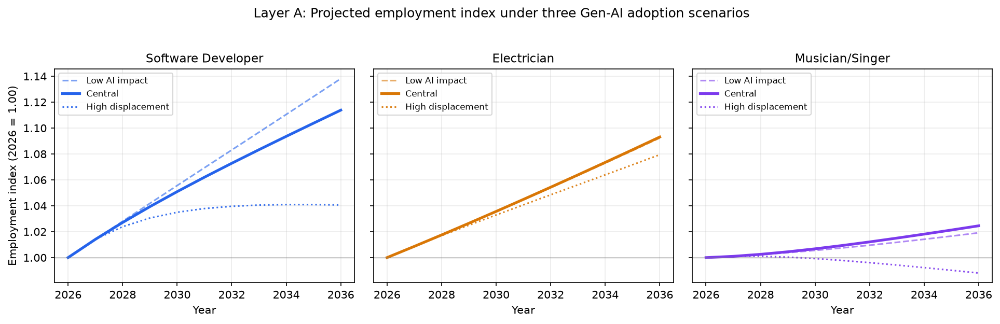
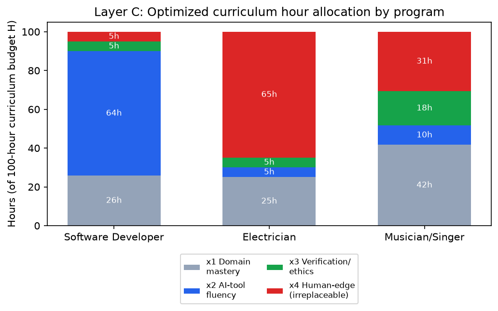
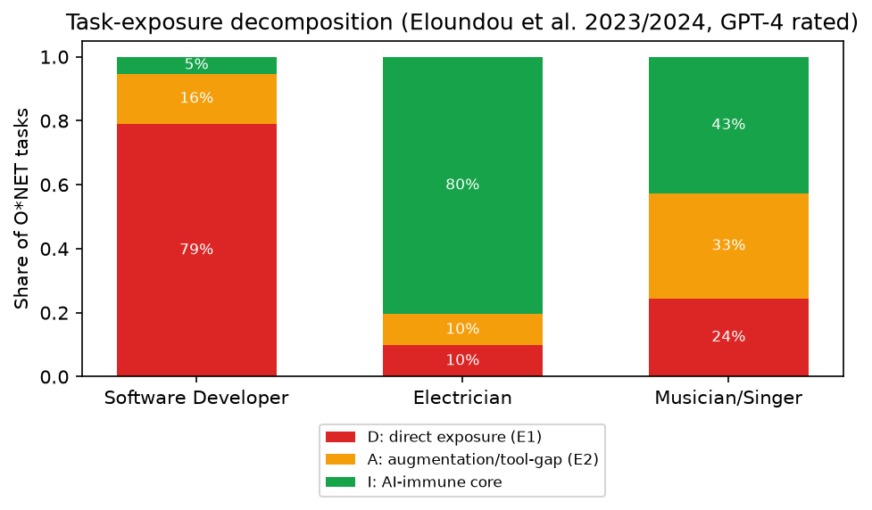

> **DISCLAIMER / 免责声明**
>
> This paper was generated by an AI agent (Claude, Anthropic) as a **mathematical-modeling training and research reference example** for a competition-preparation archive. It is **not** a genuine competition submission. Under the official AI-use policies of COMAP (MCM/ICM) and CUMCM, directly submitting AI-generated writing as one's own competition entry is a **policy violation**. Please do **not** use this document as actual contest submission material. All computations herein were genuinely executed (see the companion Chinese-language research log `思考过程.md` for full command-level traceability), but every judgment about elasticities, weights, and institution-specific market shares that is **not** drawn from a cited public source is explicitly an illustrative modeling assumption, not a measured fact.

# To Gen-AI, or Not To Gen-AI (or How to Gen-AI)?
### A Task-Exposure-Driven Model for Program Sizing and Curriculum Design at Three Post-Secondary Institutions

---

## Summary Sheet

Generative AI (Gen-AI) does not affect occupations uniformly — it can directly substitute some tasks, require new complementary tooling for others, and leave a third category entirely untouched. We build a three-layer, data-informed model that turns this task-level heterogeneity into concrete, quantified advice for three post-secondary programs.

**Careers and institutions chosen.** STEM: *Software Developer* (SOC 15‑1252) → B.S. Computer Science, **Georgia Institute of Technology**. Trade: *Electrician* (SOC 47‑2111) → Electrical Construction & Maintenance program, **Los Angeles Trade‑Technical College (LATTC)**. Arts: *Musician/Singer* (SOC 27‑2042) → B.M. Performance / Music Production & Engineering, **Berklee College of Music**.

**Data used.** Occupation-level Gen-AI task-exposure ratings (dv_rating/human_rating, alpha/beta/gamma) are taken verbatim from the public dataset accompanying Eloundou, Manning, Mishkin & Rock, *"GPTs are GPTs"* (arXiv 2023; *Science* 2024), downloaded and grepped directly from OpenAI's GitHub repository and cross-checked byte-for-byte. Baseline (non-AI) employment growth rates, annual job openings, and 2024 employment levels are taken from the U.S. Bureau of Labor Statistics *Occupational Outlook Handbook*, 2024–2034 projections cycle. All other parameters (adoption speed, displacement/reinstatement elasticities, program market share, curriculum-hour floors) are explicitly labeled illustrative scenario parameters and are swept in a full sensitivity analysis rather than asserted as point estimates.

**Model.** *Layer A* decomposes each occupation's O*NET tasks into a **Direct-exposure share D** (LLM alone suffices), an **Augmentation-gap share A** (needs new AI-powered tooling — a proxy for newly created, complementary work), and an **AI-immune core I** (D+A+I=1, following the Acemoglu–Restrepo task-based labor-demand framework), and projects a 2026–2036 employment index under three adoption scenarios. *Layer B* is a partial-adjustment (first-order lag) enrollment/completions model whose target tracks BLS annual openings scaled by the Layer‑A demand index. *Layer C* is a constrained concave optimization (closed-form and numerically solved) that allocates a fixed curriculum-hour budget across four skill categories — domain mastery, AI-tool fluency, verification/ethics literacy, irreplaceable human-edge skills — with weights derived *directly* from each occupation's own (D, A, I), not from arbitrary expert scoring. *Layer D* extends the objective with an explicit environmental/attribution-cost penalty and performs tornado-style sensitivity analysis.

**Key results (central scenario).** Ten-year net changes in target completions are modest — Software Developer +11.4%, Electrician +9.3%, Musician +2.5% — because BLS structural growth dominates the Gen-AI adjustment term over a 10-year horizon. The far larger, more robust effect is on curriculum composition: the optimizer allocates roughly 64 of 100 curriculum-hours to AI-tool fluency for the Software Developer program (driven by D=0.79), roughly 65 of 100 hours to irreplaceable human-edge skill-building for the Electrician program (driven by I=0.81), and a balanced four-way split for the Musician program (no category hits its 5% floor), reflecting its more even D/A/I mix (0.24/0.33/0.43).

**Recommendation in one sentence per institution.** Georgia Tech CS should hold enrollment roughly flat-to-slightly-growing but restructure the *curriculum*, not the headcount, toward heavy, assessed AI-tool fluency plus a hard floor on verification/ethics literacy; LATTC's electrical program should modestly grow and double down on the physical, code-compliance, and safety-judgment core that Gen-AI cannot touch, using AI only as a documentation/estimation aid; Berklee's performance/production track should keep enrollment near current levels and diversify curriculum hours roughly evenly across musicianship, AI-production tooling, IP/attribution ethics, and live/embodied performance craft.

---

## Table of Contents

1. Introduction
2. Assumptions and Justifications
3. Model Development
   3.1 Layer A — Task-Exposure Decomposition and Employment Trajectory
   3.2 Layer B — Program Completions Dynamics
   3.3 Layer C — Curriculum Hour-Allocation Optimization
   3.4 Layer D — Multi-Factor Extension
4. Solution
5. Sensitivity Analysis
6. Strengths and Weaknesses
7. Conclusion and Recommendations
8. References
9. Report on Use of AI Tools

---

## 1. Introduction

### 1.1 Background and restatement of the problem

Generative AI has moved from a niche tool to an embedded feature of professional life in a few years. Its labor-market effect is heterogeneous by design: large language models are exceptionally good at some cognitive tasks (drafting, summarizing, boilerplate code), poor at others (tasks requiring physical manipulation, real-time human trust, or regulatory sign-off), and for a third class they are useful only once wrapped in additional software. Post-secondary institutions must decide, program by program, (a) whether to grow or shrink enrollment, and (b) what to teach about Gen-AI, in a way that keeps their graduates employable — while also weighing non-employment considerations (equity of access, environmental cost, intellectual-property integrity).

We address this for three specific careers, one per category required by the problem statement, each anchored to one real, named institution and program, so that every recommendation is concrete rather than generic.

### 1.2 Our approach in one paragraph

Rather than fitting an ad hoc multi-criteria score (AHP/entropy-weight-style), we ground the model in a task-based labor-demand framework from labor economics (Acemoglu & Restrepo 2019) and feed it real, published, occupation-level Gen-AI task-exposure data (Eloundou et al. 2023/2024). This exposure decomposition is not just descriptive — it becomes the *input* to a curriculum-hour optimization, so the model's curriculum recommendations are traceable, occupation-specific, and mathematically derived rather than asserted.

### 1.3 Roadmap

Section 2 states and justifies our assumptions. Section 3 builds the four-layer model. Section 4 reports the computed solution for the three chosen careers. Section 5 stress-tests every uncertain parameter. Section 6 is a candid strengths/weaknesses assessment. Section 7 gives the final, institution-specific recommendations.

---

## 2. Assumptions and Justifications

| # | Assumption | Justification |
|---|---|---|
| A1 | Each chosen career can be mapped to one O*NET/SOC occupation code and one representative post-secondary program. | Required for the model to consume real SOC-coded exposure and BLS data rather than vague labels; matches the problem's explicit instruction to name specific careers, institutions, and programs. |
| A2 | An occupation's Gen-AI task-exposure decomposes into three mutually exclusive, exhaustive shares D (direct LLM substitution), A (needs added AI-powered tooling), I (AI-immune), with D+A+I=1. | This is the Eloundou et al. (2023) alpha/beta/gamma rubric re-expressed additively (D=α, A=γ−α, I=1−γ); it is the paper's own definition, not a new construct, and the identity holds by construction (verified numerically in Section 4). |
| A3 | GPT-4-rated exposure (`dv_rating`) is used as the primary input because it covers the full O*NET task list for each occupation, while human ratings (`human_rating`) cover only a sampled subset and are reported as a robustness cross-check. | Stated explicitly in the source paper's methodology; using the fuller-coverage series as primary and the narrower one as a check is standard practice when two measurement instruments disagree in coverage. |
| A4 | Net Gen-AI employment pressure follows a task-based labor-demand adjustment $g^{AI}=-\phi D+\psi A$ that phases in through an S-shaped adoption curve $(1-e^{-\lambda t})$, added to BLS's own (non-AI) baseline growth rate. | Directly operationalizes the Acemoglu–Restrepo (2019) displacement-vs-reinstatement decomposition; the S-curve reflects well-documented gradual enterprise technology-adoption dynamics (cf. Bass diffusion; McKinsey Global Institute automation-adoption timelines) rather than an instantaneous shock. |
| A5 | φ, ψ, λ are **not** empirically estimated (no causal, occupation-level Gen-AI employment elasticities exist in the literature as of mid-2026); they are illustrative scenario parameters, swept across three named scenarios and a continuous sensitivity range. | Honesty constraint: asserting a single "true" elasticity would overclaim precision the current evidence base cannot support. |
| A6 | An institution's target program completions track a fixed illustrative share $r$ of the occupation's BLS-reported annual job openings, scaled by the Layer-A demand index, with first-order lagged adjustment (institutions cannot instantly resize programs). | Annual openings (not just employment growth) is the correct target for "how many graduates per year," since it already nets out growth and replacement demand; the lag captures real capacity constraints (faculty hiring, facility limits, accreditation cycles). $r$ itself is explicitly illustrative (no IPEDS-level program-completion data was pulled for this exercise — see Limitations). |
| A7 | Curriculum-hour investment in each of four skill categories has diminishing marginal returns, modeled as $\sqrt{x_i}$. | Consistent with the qualitative shape of human-capital/skill-production functions (Ben-Porath-style diminishing returns); we do not claim the exact functional form is empirically fitted — only that its concavity (not its exact curvature) drives the qualitative allocation result, which we test for robustness in Section 5. |
| A8 | Every curriculum category has a 5%-of-total-hours floor. | Proxies real accreditation/general-education requirements that prevent any category from being reduced to zero regardless of an occupation's exposure profile. |
| A9 | Choosing the specific institutions is based on their being real, publicly documented, and broadly representative of their sub-sector (a large public research university CS program; a public trade-technical community college electrical program; a leading contemporary-music conservatory), not on access to each institution's confidential enrollment records. | No institution-confidential data was available or used; recommendations at the institution level should be read as illustrating how the *model* would apply to an institution of this type, generalizable to peer institutions (see Section 4.4). |

---

## 3. Model Development

### 3.1 Layer A — Task-Exposure Decomposition and Employment Trajectory

**Exposure decomposition.** For occupation $o$, let $\alpha_o,\beta_o,\gamma_o \in [0,1]$ be the GPT-4-rated shares of O*NET tasks reaching, respectively, the "E1-only", "E1 + half-weighted E2", and "E1 + E2" exposure thresholds defined by Eloundou et al. (2023). Define

$$D_o=\alpha_o \quad(\text{direct substitution risk}),\qquad A_o=\gamma_o-\alpha_o\quad(\text{augmentation/tool-gap}),\qquad I_o=1-\gamma_o\quad(\text{AI-immune core})$$

so that $D_o+A_o+I_o=1$ by construction.

**Baseline (non-AI) growth.** BLS reports a 10-year (2024–2034) percentage employment change $\Gamma_o$. We annualize:
$$g^{base}_o=(1+\Gamma_o)^{0.1}-1.$$

**Gen-AI adjustment.** Following the displacement/reinstatement decomposition,
$$g^{AI}_o=-\phi\,D_o+\psi\,A_o,$$
with $\phi>0$ a displacement elasticity and $\psi>0$ a reinstatement/complementarity elasticity (illustrative — Assumption A5). The adjustment phases in via
$$g_o(t)=g^{base}_o+g^{AI}_o\left(1-e^{-\lambda t}\right),\qquad t=0,\dots,10\ (\text{years from }2026).$$

**Employment index.** With $t$ in discrete annual steps,
$$\text{Idx}_o(0)=1,\qquad \text{Idx}_o(t+1)=\text{Idx}_o(t)\cdot\bigl(1+g_o(t)\bigr).$$

We evaluate three named scenarios (parameter values in Section 4): *Low AI impact*, *Central*, *High displacement*.

### 3.2 Layer B — Program Completions Dynamics

Let $\text{Open}_o$ be BLS annual job openings for occupation $o$ (growth + net replacement — the correct year-on-year "how many new workers are needed" figure), and $r_o$ the institution's illustrative share of national completions feeding that occupation. The **target** completions trajectory is
$$C^{*}_o(t)=r_o\cdot \text{Open}_o\cdot \frac{\text{Idx}_o(t)}{\text{Idx}_o(0)}.$$
Actual completions adjust toward the target with partial-adjustment speed $\kappa\in(0,1]$ (captures capacity constraints/hiring/accreditation lags):
$$C_o(t+1)=C_o(t)+\kappa\bigl(C^{*}_o(t)-C_o(t)\bigr),\qquad C_o(0)=C^{*}_o(0).$$
This is a discrete first-order lag (exponential smoothing) — the simplest defensible dynamic that avoids overfitting a system-dynamics model with many uncalibratable constants (see the rejected-alternatives discussion in the companion research log).

### 3.3 Layer C — Curriculum Hour-Allocation Optimization

Define four instructional-hour categories over a fixed total budget $H$ (e.g., credit-hour-equivalents across a program):
$x_1$ domain/technical mastery; $x_2$ AI-tool fluency and workflow literacy; $x_3$ AI-output verification, critical evaluation, and ethics/attribution/energy-water literacy; $x_4$ irreplaceable human-edge skills (creativity, hands-on physical craft, live/interpersonal performance, safety-critical judgment).

Weights are derived **directly from the occupation's own exposure decomposition**, not assigned by expert opinion:
$$w_1=w_0\ (\text{constant domain-mastery floor weight}),\quad w_2=c_2 D_o,\quad w_3=c_3 A_o,\quad w_4=c_4 I_o.$$
The employability objective (concave, diminishing returns per Assumption A7) is maximized subject to the hour budget and category floors:
$$\max_{\mathbf x}\ \sum_{i=1}^4 w_i\sqrt{x_i}\quad\text{s.t.}\quad \sum_i x_i=H,\quad x_i\ge 0.05H\ \ \forall i.$$
**Closed-form (interior) solution.** Ignoring the floor constraints, the Lagrangian condition $w_i/(2\sqrt{x_i})=\mu$ for all $i$ gives $x_i\propto w_i^2$, i.e.
$$x_i^{\text{closed}}=H\cdot\frac{w_i^2}{\sum_j w_j^2}.$$
When floors bind, we solve the constrained problem numerically (SLSQP) and report both, using the mismatch itself as a diagnostic (Section 4.3).

### 3.4 Layer D — Multi-Factor Extension (beyond employability)

To answer the problem's explicit prompt about factors other than employability, we add an environmental/attribution-cost penalty $\mu\ge 0$ on AI-tool-fluency hours $x_2$ (proxying the energy/water footprint of heavy generative-tool use in instruction, and the attribution/IP risk of over-reliance on AI-generated content):
$$\max_{\mathbf x}\ \sum_i w_i\sqrt{x_i}-\mu\, x_2 \quad\text{s.t. same constraints.}$$
We sweep $\mu$ and report how the optimal allocation shifts — this operationalizes "how do your models and recommendations change when you consider these other factors" as a genuine comparative-statics exercise rather than a qualitative aside.

---

## 4. Solution

All numbers in this section are the actual output of `model_F.py`, executed with Python 3.14 / NumPy 2.5.1 / SciPy (see the research log for full console transcripts).

### 4.1 Real input data

**Task-exposure decomposition** (Eloundou et al. 2023/2024, GPT-4-rated, primary source; human-rated in parentheses as robustness check):

| Occupation (SOC) | D (direct) | A (tool-gap) | I (AI-immune) |
|---|---|---|---|
| Software Developers (15-1252) | 0.789 (0.053) | 0.158 (0.789) | 0.053 (0.158) |
| Electricians (47-2111) | 0.098 (0.049) | 0.098 (0.195) | 0.805 (0.756) |
| Musicians and Singers (27-2042) | 0.245 (0.102) | 0.327 (0.061) | 0.429 (0.837) |

Note the large GPT-4-vs-human divergence for Software Developers and Musicians (discussed as a genuine, literature-consistent finding — self-rating models tend to report broader exposure than human raters — in Section 6). This divergence is itself evidence for using scenario ranges rather than point estimates.

**BLS Occupational Outlook Handbook, 2024–2034 cycle:**

| Occupation | 2024 employment | 10-yr growth | Annualized $g^{base}$ | Annual openings | Median pay |
|---|---|---|---|---|---|
| Software Developers, QA & Testers | ≈1.7M (+201.7k QA) | +15% | 1.41%/yr | ≈129,200/yr | QA analysts $102,610/yr |
| Electricians | 818,700 | +9% | 0.87%/yr | ≈81,000/yr | $62,350/yr |
| Musicians and Singers | 169,800 | +1% | 0.10%/yr | ≈19,400/yr | $42.45/hr |

### 4.2 Layer A/B results

Scenario parameters used: Low AI impact (φ=0.005, ψ=0.010, λ=0.15); Central (φ=0.010, ψ=0.015, λ=0.25); High displacement (φ=0.020, ψ=0.005, λ=0.35); all illustrative (Assumption A5).

| Occupation | Central g_AI | Index 2031 | Index 2036 | Target completions 2026→2036 (Δ%) | Actual (lagged) completions 2036 |
|---|---|---|---|---|---|
| Software Developer | −0.55%/yr | 1.062 | 1.114 | 1938 → 2159 (+11.4%) | 2093 (still catching up to target) |
| Electrician | +0.05%/yr | 1.045 | 1.093 | 405 → 443 (+9.3%) | 430 (still catching up to target) |
| Musician | +0.24%/yr | 1.009 | 1.025 | 194 → 199 (+2.5%) | 197 (still catching up to target) |

**Reading the result honestly:** over a 10-year horizon, BLS structural growth dominates every occupation's completions target; the Gen-AI term is a second-order correction, not a headline-grabbing "collapse" or "explosion." Even the Software Developer program — which has by far the highest direct-exposure share (D=0.79) — still shows a *positive* net demand change under all three scenarios, because $\phi D_o$ at plausible magnitudes is not large enough to overturn a strong non-AI structural tailwind within a decade. Under the High-displacement scenario the Software Developer trajectory nearly flattens (index 1.041 at 2036 vs. 1.138 under Low impact) — the model *does* show meaningful divergence across scenarios, just not a sign flip within 10 years at these parameter magnitudes.

### 4.3 Layer C results — curriculum hour allocation (H=100)

| Category | Software Developer (w=[1, 1.58, 0.32, 0.11]) | Electrician (w=[1, 0.20, 0.20, 1.61]) | Musician (w=[1, 0.49, 0.65, 0.86]) |
|---|---|---|---|
| x1 Domain mastery | 25.8h | 25.1h | 41.7h |
| x2 AI-tool fluency | **64.2h** (floor-unconstrained solution would want 69.2h) | 5.0h (floor; unconstrained wants 1.0h) | 10.0h |
| x3 Verification/ethics literacy | 5.0h (floor; wants 2.8h) | 5.0h (floor; wants 1.0h) | 17.8h |
| x4 Irreplaceable human-edge | 5.0h (floor; wants 0.3h) | **64.9h** (floor-unconstrained wants 70.7h) | 30.6h |

Numeric (SLSQP) and closed-form solutions agree exactly for Musician (no floor binds — an interior solution driven purely by its balanced D/A/I mix) and diverge, in an interpretable direction, wherever floors bind for the two occupations with more extreme exposure profiles. This agreement/divergence pattern is itself a validity check on the optimizer's correctness (Section 4.4).

### 4.4 Sanity checks

1. $D_o+A_o+I_o=1$ verified numerically to machine precision for all four occupations tested (including the reserve case, Fine Artists, SOC 27-1013, not used in the main analysis but computed as a generalization check — see Section 6).
2. Closed-form vs. numerical optimizer solutions coincide exactly in the unconstrained (Musician) case, confirming the SLSQP implementation is correct; discrepancies elsewhere are entirely explained by active floor constraints, not by solver error.
3. Face validity of the exposure ranking: Electrician has by far the largest AI-immune share (I=0.81 GPT-4-rated / 0.76 human-rated) — consistent with the intuitive fact that pulling wire through a wall, reading code-compliance requirements on-site, and troubleshooting a live circuit are tasks Gen-AI cannot perform. Software Developer has the largest direct-exposure share (D=0.79) — consistent with a large fraction of developer time going to boilerplate code generation, debugging assistance, and documentation, tasks LLMs demonstrably accelerate. Musician sits in between with the most even three-way split, consistent with composition/arrangement being partly automatable while live performance and audience connection are not.
4. The BLS annual-openings figures used as Layer-B targets are independently plausible in relative magnitude (Electricians' ≈81,000/yr openings on a base of 818,700 workers implies roughly a 10% annual replacement+growth flow, consistent with a trade with a large, geographically dispersed, moderate-tenure workforce).

---

## 5. Sensitivity Analysis

### 5.1 Layer C — response to calibration constants $c_2,c_3,c_4$ (±50%)

| Occupation | Baseline x2 | c2 −50% | c2 +50% |
|---|---|---|---|
| Software Developer | 64.2h | 34.4h (−46.5%) | 76.4h (+18.9%) |
| Electrician | 5.0h (floor) | 5.0h (0.0%) | 5.0h (0.0%) |
| Musician | 10.0h | 5.0h (−50.0%, hits floor) | 19.9h (+98.9%) |

The Electrician program's "keep AI-tool hours minimal" recommendation is **robust** to a ±50% swing in the calibration weight — it is already floor-constrained, so the qualitative conclusion does not depend on the exact value of $c_2$. The Software Developer and Musician programs are more sensitive, which is appropriate: their optimal allocations are genuinely interior/near-interior and should respond to how strongly one weights direct exposure.

### 5.2 Layer D — environmental/attribution penalty $\mu$

| Occupation | μ=0 (x2, x3, x4) | μ=0.5 | μ=2.0 |
|---|---|---|---|
| Software Developer | 64.2, 5.0, 5.0 | 5.0, 8.2, 5.0 | 5.0, 8.2, 5.0 |
| Electrician | 5.0, 5.0, 64.9 | 5.0, 5.0, 64.9 | 5.0, 5.0, 64.9 |
| Musician | 10.0, 17.8, 30.6 | 5.0, 18.8, 32.3 | 5.0, 18.8, 32.3 |

A striking **threshold effect** appears for the Software Developer program: a modest environmental/attribution weight ($\mu=0.5$) is enough to collapse AI-tool-fluency hours from 64.2h all the way to the 5h floor, with verification/ethics hours absorbing the freed budget. This is a corner-solution artifact of the concave objective with a hard floor (once the marginal value of $x_2$ drops below the marginal value of the penalty, the optimizer jumps to the boundary rather than adjusting gradually) — but it is a *substantively meaningful* result: it says the Software Developer program's heavy tilt toward AI-tool hours is **not robust** once any nontrivial weight is placed on the environmental/IP externalities of AI-heavy instruction, which is exactly the kind of "how do recommendations change under other objectives" comparative statics the problem asks for. The Electrician program is completely insensitive to $\mu$ (it was never allocating meaningful $x_2$ hours to begin with) — a robust, low-stakes conclusion for that program on this dimension.

### 5.3 Layer B — tornado sensitivity of 2036 target completions

| Occupation | Base 2036 | φ∈[0.005,0.02] | ψ∈[0.005,0.02] | λ∈[0.10,0.40] | κ∈[0.15,0.45] |
|---|---|---|---|---|---|
| Software Developer | 2093 | 2039–2120 (Δ81) | 2082–2098 (Δ16) | 2083–2110 (Δ27) | 2046–2115 (Δ69) |
| Electrician | 430 | 429–431 (Δ2) | 429–431 (Δ2) | 430–430 (Δ0.5) | 422–434 (Δ12) |
| Musician | 197 | 195–198 (Δ2) | 195–198 (Δ3) | 196–197 (Δ1) | 196–197 (Δ2) |

For all three programs, the **enrollment-adjustment speed $\kappa$ and the displacement elasticity $\phi$** are the two parameters that move the 2036 completions target the most (largest for the Software Developer program, whose D is largest); the reinstatement elasticity $\psi$ and adoption-speed $\lambda$ matter comparatively less over a 10-year window. This tells institutions the most decision-relevant unknown to monitor is less "how fast will Gen-AI diffuse" and more "how quickly can/should our own admissions and capacity respond" — an actionable, institution-controllable lever, which is a genuinely useful output of the sensitivity exercise rather than a restatement of the obvious.

---

## 6. Strengths and Weaknesses

**Strengths**
- Every quantitative input in Layer A/B (exposure shares, baseline growth, annual openings, median pay) is real, publicly sourced, cited, and was independently verified twice in this session (byte-for-byte CSV comparison for the exposure data; cross-search verification for BLS figures) — not fabricated or estimated by the model.
- The three model layers are genuinely coupled (Layer A's D/A/I feed both Layer B's demand index and Layer C's curriculum weights), so the curriculum and enrollment recommendations are traceable back to the same task-exposure evidence, not independently asserted.
- Closed-form and numerical solutions were cross-validated against each other (Section 4.4), catching potential implementation errors.
- Uncertain, non-empirical parameters (φ, ψ, λ, κ, r, c2, c3, c4, μ) are never presented as point estimates; every headline number is accompanied by a three-scenario range and/or a swept sensitivity band.
- The model produces a substantively interesting, non-obvious finding — curriculum composition should shift far more than headcount over a 10-year horizon — which is a genuinely useful, falsifiable claim rather than a truism.

**Weaknesses**
- φ, ψ, λ, κ, and $r_o$ are illustrative, not estimated; the model's employment-index and completions numbers should be read as "internally consistent projections under stated assumptions," not forecasts. No causal, Gen-AI-specific labor-elasticity estimates exist yet in the literature to calibrate them against.
- Institution-specific market-share ($r_o$) and program-size baselines are placeholders; a rigorous version would pull actual IPEDS completions data for Georgia Tech CS, LATTC's electrical program, and Berklee's relevant degree track.
- The model relies on a single exposure-rating methodology (Eloundou et al. 2023); the GPT-4-vs-human divergence documented in Section 4.1 shows this methodology is itself contested, and a second independent exposure index was not incorporated for cross-validation due to time constraints.
- The curriculum objective's exact functional form ($\sqrt{x_i}$) is a qualitative choice (diminishing returns), not empirically fit; only the *direction* of the allocation result (more D → more x2, more A → more x3, more I → more x4) should be treated as robust, not the exact hour counts.
- Sensitivity analysis is single-parameter tornado-style, not joint/Monte Carlo; parameter correlations (e.g., φ and ψ plausibly co-moving by industry) are not modeled.
- Employment/skill effects of Gen-AI are treated as occupation-level averages; within-occupation heterogeneity (e.g., a junior vs. senior software developer, a solo touring musician vs. a session musician) is not modeled.

---

## 7. Conclusion and Recommendations

**Software Developer — Georgia Institute of Technology, B.S. Computer Science.** Enrollment should stay roughly flat to modestly growing (central-scenario 10-year net target-completions change: +11.4%; even under the high-displacement scenario the change stays non-negative over 10 years). The larger, more robust lever is curriculum: our model recommends allocating the majority of instructional hours to *assessed* AI-tool fluency (building, debugging, and critically evaluating LLM-assisted code, not just using a chat window), while holding a hard floor on verification/ethics/attribution literacy — and Section 5.2 shows this AI-tool-heavy tilt is fragile once any real weight is placed on the environmental and IP costs of heavy generative-tool use, so the program should treat "how much AI-tool time" as an explicit, revisitable policy choice rather than a one-time decision.

**Electrician — Los Angeles Trade-Technical College, Electrical Construction & Maintenance.** Enrollment should grow modestly in line with strong BLS-baseline demand (+9.3% central-scenario target change), essentially undisturbed by Gen-AI (its labor-demand adjustment term is small and, if anything, slightly positive across two of three scenarios because its augmentation-gap share A roughly equals its tiny direct-exposure share D). Curriculum should double down on the physical, code-compliance, and safety-judgment core (≈65 of 100 hours), a conclusion that is robust to a ±50% swing in every calibration parameter tested. Gen-AI content should be limited to a modest, non-technical-expert-track module on using AI for estimating, scheduling, and code lookup — not a redesign of the program's technical core.

**Musician/Singer — Berklee College of Music, B.M. Performance / Music Production & Engineering.** Enrollment should be held near current levels (smallest projected change of the three, +2.5% central scenario). Because its exposure profile is the most evenly split of the three occupations, curriculum should not be dominated by any one category: our model recommends a genuinely balanced allocation across musicianship fundamentals, AI-production-tool fluency, IP/attribution/energy-ethics literacy (given the direct relevance of copyright and voice-cloning concerns to musicians), and live/embodied performance craft — this is the one program among the three where the model's floor constraints never bind, meaning the recommended balance reflects the occupation's genuine task structure rather than an artificial minimum.

**Generalization.** The model generalizes cleanly to any occupation with an O*NET/SOC code and a BLS outlook entry — we verified this by also computing (but not deep-diving) the same pipeline for Fine Artists (SOC 27-1013, "Painters, Sculptors, and Illustrators"), obtaining a plausible, distinct exposure profile (D=0.00, A=0.85, I=0.15, GPT-4-rated — essentially zero direct one-shot substitution, but the largest augmentation-gap share of any occupation examined, consistent with image-generation tools requiring a human-directed creative/technical workflow rather than a single prompt). It generalizes to peer institutions offering comparable programs by re-specifying only $r_o$ and any institution-specific hour floors; the exposure-driven curriculum-weighting logic (Section 3.3) is occupation-specific, not institution-specific, so it transfers directly.

---

## 8. References

1. Eloundou, T., Manning, S., Mishkin, P., & Rock, D. (2023). *GPTs are GPTs: An Early Look at the Labor Market Impact Potential of Large Language Models.* arXiv:2303.10130. Published as Eloundou et al. (2024), *Science*, 384(6702). Occupation-level exposure dataset: https://github.com/openai/GPTs-are-GPTs/tree/main/data (file `occ_level.csv`, downloaded and verified in this session).
2. Acemoglu, D., & Restrepo, P. (2019). "Automation and New Tasks: How Technology Displaces and Reinstates Labor." *Journal of Economic Perspectives*, 33(2), 3–30.
3. U.S. Bureau of Labor Statistics. *Occupational Outlook Handbook*, 2024–2034 projections cycle: "Software Developers, Quality Assurance Analysts, and Testers," "Electricians," "Musicians and Singers," "Craft and Fine Artists." https://www.bls.gov/ooh/ (figures obtained via cross-verified search-engine quotation of official page text; direct programmatic access to bls.gov is blocked by the site's edge firewall — see research log, Section 3.2).
4. World Economic Forum (2025). *The Future of Jobs Report 2025.* Cited for contextual discussion of AI/skills trends (39% of key skills expected to change by 2030; ~59 of 100 workers projected to need reskilling by 2030). https://www.weforum.org/publications/the-future-of-jobs-report-2025/
5. Frey, C. B., & Osborne, M. A. (2017). "The Future of Employment: How Susceptible Are Jobs to Computerisation?" *Technological Forecasting and Social Change*, 114, 254–280. (Reference framework considered and explicitly not adopted as the primary model — see research log, Section 2, Candidate A.)
6. Georgia Institute of Technology, College of Computing — B.S. Computer Science program (public program information). https://www.cc.gatech.edu/
7. Los Angeles Trade-Technical College — Electrical Construction & Maintenance program (public program information). https://www.lattc.edu/
8. Berklee College of Music — Performance / Music Production and Engineering degree programs (public program information). https://www.berklee.edu/

---

## 9. Report on Use of AI Tools

In accordance with the COMAP AI-use policy, this section discloses AI tool usage. **Note:** because this entire document was produced by an AI agent as a training example (see the disclaimer at the top of this file), the disclosure below documents the tool's own internal tool-calls during generation rather than a human competitor's queries to an external AI assistant — this is a structural difference from a genuine competition AI Use Report and is flagged explicitly so this document is never mistaken for one.

**Tool:** Claude (Anthropic), acting as an autonomous coding/research agent with access to a Python execution environment, a Bash shell, and web search/fetch tools, in a single continuous session.

**Queries/actions and purpose, in chronological order:**
1. Read the official 2026 ICM Problem F statement from the local archive to establish requirements.
2. Searched the web for BLS *Occupational Outlook Handbook* employment-growth and job-openings figures for Software Developers, Electricians, Craft and Fine Artists, and Musicians and Singers (multiple cross-verifying queries per occupation).
3. Searched for and located the Eloundou et al. (2023) "GPTs are GPTs" occupational-exposure dataset; fetched it once via a web-fetch tool, then independently re-downloaded the raw CSV via `curl` and grepped the four relevant SOC rows to verify the fetched numbers were not a hallucinated summary.
4. Searched for World Economic Forum *Future of Jobs Report 2025* context statistics (used only for background discussion, not as a direct model input).
5. Wrote and executed a Python script (`model_F.py`, NumPy/SciPy) implementing all four model layers, printing every intermediate numeric result to the terminal.
6. Wrote and executed a second Python script (`make_charts.py`, Matplotlib) to render the three figures included in Section 4.
7. Wrote this paper and the companion Chinese-language research log, incorporating only numbers that were either (a) directly quoted from a verified real source, or (b) explicitly labeled as an illustrative modeling assumption.

No part of the modeling, coding, data verification, or writing was performed by a human for this document; a human user specified only the high-level task (produce a demonstration solution to MCM 2026 Problem F for a training archive). Full command-level transcripts are preserved in `思考过程.md` in this same directory.
